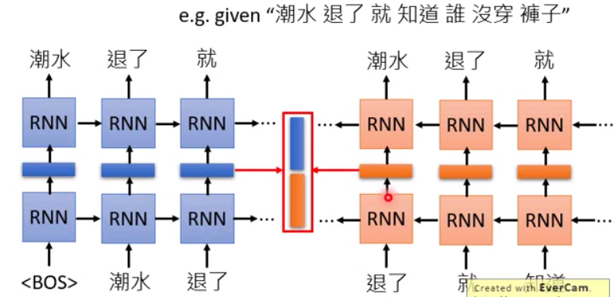
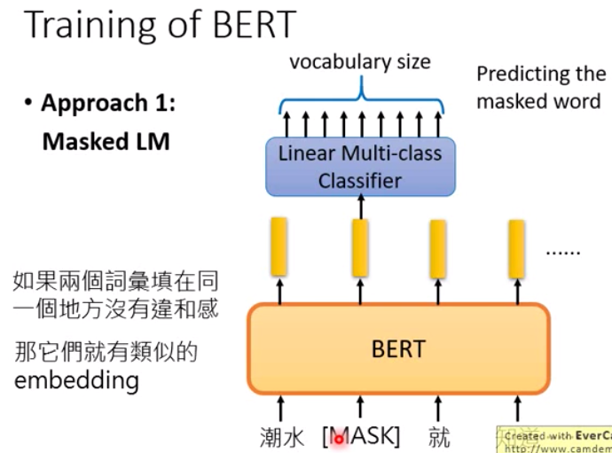
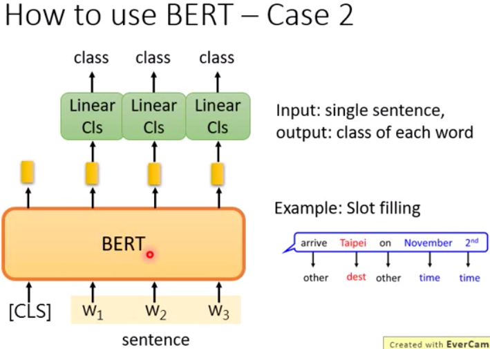
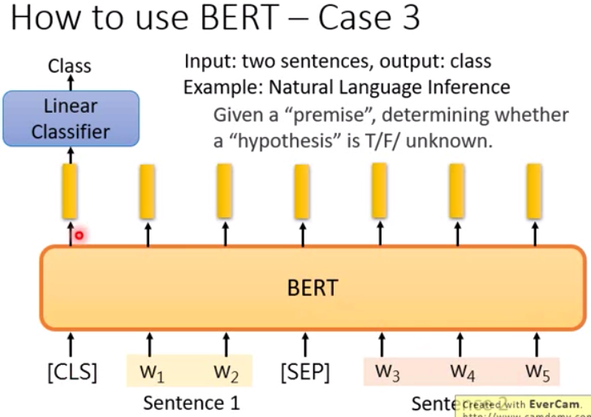
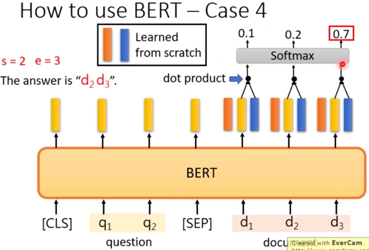
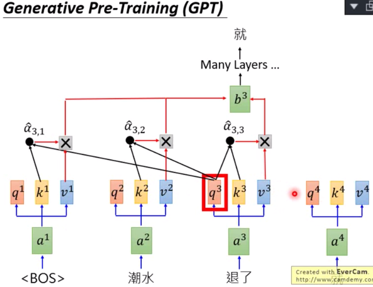

# 7. Pretrained Model

## 7.1 Overview

#### Paper

- 【Great】<https://github.com/thunlp/PLMpapers>

    Must-read Papers on pre-trained language models  各预训练模型层次衍生关系图

#### Article

- [8 Excellent Pretrained Models to get you Started with NLP - 2019](https://www.analyticsvidhya.com/blog/2019/03/pretrained-models-get-started-nlp/)

    包括：ULMFiT, Transformer, BERT, Transformer-XL, GPT-2, ELMo, Flair, StanfordNLP

    **Chinese**：[8种优秀预训练模型大盘点，NLP应用so easy！](https://mp.weixin.qq.com/s?__biz=MjM5MTQzNzU2NA==&mid=2651669109&idx=2&sn=29b4e45291eac659af2967a1e246aa03)

- [Generalized Language Models - 2019](https://lilianweng.github.io/lil-log/2019/01/31/generalized-language-models.html)

    包括：CoVe, ELMo, Croww-View Training, ULMFiT, GPT, BERT, GPT-2

    **Chinese**：[上下文预训练模型最全整理：原理、应用、开源代码、数据分享](https://mp.weixin.qq.com/s?__biz=MzIxNDgzNDg3NQ==&mid=2247485551&idx=1&sn=de0a04647870543fe0b36d024f58429e)

- [Language Models and Contextualised Word Embeddings - 2018](http://www.davidsbatista.net/blog/2018/12/06/Word_Embeddings/)
  
    对 ELMo, BERT 及其他模型进行了一个简单的综述

- 【Great】[从Word Embedding到Bert模型—自然语言处理中的预训练技术发展史 - 张俊林 - 2018](https://zhuanlan.zhihu.com/p/49271699)

    **YAO**: OK

    NLP里面做预训练一般的选择是用语言模型任务来做；预训练+Finetuning将成为NLP领域的流行方法；

    **Word2Vec**

    Word Embedding作为预训练过程的方式：Embedding矩阵是网络的**Onehot层到Embedding层映射的初始化参数矩阵**，初始化后可以Frozen OR Finetuning

    这是2018年之前NLP预训练的典型做法，但Word Embedding有一个致命缺点：多义词问题，Word Embedding是静态的，无法区分多义词的不同语义。直接解决这个问题比较成本太高或太繁，从而催生了更简洁优雅的解决方案：ELMo

    **ELMo**

    解决多义词问题的理念：事先用语言模型学好单词Bank的Embedding，是静态的，也无法区分多义性，但随后在实际使用时，单词Bank具备了特定的上下文，这时再根据上下文去调整Bank的Embedding。ELMO本质思想是：**根据上下文对Embedding动态调整**。

    预训练阶段：输入原始静态Embedding，通过多层编码器学习一个通用语言模型，**ELMo预训练好的是各层编码器的参数，或者说是一个通用语言模型**

    **TODO**: 每层编码器是两层RNN，对应一个Embedding？还是说两层RNN对应两个Embedding？

    使用阶段：输入1个句子，对于句子中的1个单词，每层编码器都会输出1个动态的Embedding，再结合下游任务学习权重，把各层的Embedding加权整合为一个，就是下游任务中该单词的Embedding，所以ELMo代表的是一种**基于特征融合的预训练**方法。由于ELMo给下游提供的是**每个单词**的特征形式，所以这一类预训练方法被称为Feature-based Pre-Training。

    **TODO**: 补充特征？Embedding加权整合为一个后，还需要再加上原始静态的Embedding吗？

    尧：形象来说，预训练模型朝上竖着站立，ELMo是横着各层给右侧的下游任务；而Bert和GPT是上面最后一层给上面的下游任务。？？？

    对比Bert和GPT，ELMo的缺点有：RNN/LSTM抽取特征的能力远远弱于Transformer；双向拼接这种特征融合能力可能弱于Bert那种一体化的特征融合方式(只是推断，没有实验证明)。

    **GPT**

    预训练阶段：与ELMo比，有2点不同：一是使用Transformer(的Decoders)来替代RNN进行特征抽取；二是语言模型是单向的，即只使用上文来预测下一单词，并未使用下文，这一点并不明智。

    使用阶段：对于不同的下游任务，要把任务的网络结构改造成**和GPT一样的网络结构**，然后使用预训练阶段学到的参数去**初始化**这个网络结构，这样通过预训练学到的语言知识就引入到下游任务中了。另外，这个网络结构可以Finetuning。这种模式与图像领域使用预训练的模式是一样的：**先构建一样的结构，然后加载预训练好的参数**。

    任务结构改造的重点其实**只需要修改输入的形式**，GPT论文里有详细说明，比如：

    - 文本分类：Text --> START + Text + EXTRACT

    - 文本推断：Premise + Hypothesis --> START + Premise + DELIM + Hypothesis + EXTRACT

    - 文本相似：Text1 + Text2 --> (START + Text1 + DELIM + Text2), (START + Text2 + DELIM + Text1)

    - 多项选择：Context + Answer1 + Answer2 + Answer3 --> (START + Context + DELIM + Answer1 + EXTRACT), (START + Context + DELIM + Answer2 + EXTRACT), (START + Context + DELIM + Answer3 + EXTRACT)

    GPT缺点：语言模型是单向而非双向的

    **BERT**

    特征提取，ELMo使用的是RNN，GPT使用的是Transformer的Decoders(Masked SelfAttention，单向)，而BERT使用的是Transformer的Encoders(SelfAttention，双向)，数据规模要比GPT大。BERT其实并没太大创新，更像是一个最近几年NLP重要技术的集大成者。

    **ELMo + 特征提取由RNN改成Transformer --> BERT**

    **GPT + 语言模型由单向改成双向 --> BERT**

    预训练阶段：受完型填空任务的启发，BERT用上下文去预测中间的单词，即Masked LM，本质思想与CBOW类似；另外还有一个Next Sentence Prediction，句子连续性预测。

    - Masked LM：随机选择语料中15%的单词，这些单词，有80%被Mask标记，10%随机替换成另外一个单词，10%保持不变，训练任务是基于上下文预测这个单词

    - Next Sentence Prediction: 句子级负采样，即从语料库中选两个句子A和B构成一条样本，50%的时候B的确取自A的后面，是A的Next Sentence，另外50%的时候B是从语料库中随机选择的，训练任务是判断B是否是A的Next Sentence (因此BERT可以直接得出一个整句的Embedding表示)

    这2种训练方法一起做，是个多任务过程，因为NLP很多任务是句子关系判断任务，**单词粒度的数据训练不到句子粒度**，增加第2个任务有助于下游的句子关系任务。样本数据示例如下：

    ```
    Input = '[CLS] the man went to [MASK] store [SEP] he bought a gallon [MASK] milk [SEP]'
    Label = IsNext

    Input = '[CLS] the man [MASK] to the store [SEP] penguin [MASK] are flight birds [SEP]'
    Label = NotNext
    ```

    输入部分是个线性序列，两个句子通过\[SEP]分割，最前面加个\[CLS]，最后面加个\[SEP]，句子中**每个单词有3种Embedding**，它们叠加后是BERT的输入：

    - Token Embeddings: 单词Toekn原始的静态Embedding

    - Sentence Embeddings: 样本中有2个句子，每个句子都有个整体的Embedding，然后对应给每个单词，\[CLS]跟随第1个句子，\[SEP]跟随它前面那个句子

    - Position Embeddings: 位置Embedding，同Transformer

    有效因子分析：与GPT相比，**双向语言模型起最主要作用**，尤其对于那些需要看到下文的任务，而NSP(Next Sentence Prediction)对整体性能影响不算大，跟具体任务关联度比较高。

    使用阶段：与GPT类似，也需要改造下游任务的网络结构(输入输出形式)，详情参考下面的"李宏毅-ELMO、BERT、GPT视频笔记"。BERT普适性很强，几乎可以做任何NLP下游任务。

    归纳来说，BERT的特点如下：
    
    - 两阶段模型：阶段1是双向语言模型预训练，阶段2是具体任务Finetuning或做特征集成

    - 特征抽取：使用Transformer而非RNN/CNN

    - 双向语言模型：采用CBOW那样的方法去做
    
    **预训练的本质**：设计一个网络结构来做语言模型任务，然后用大量的无标注语料预训练这个语言模型，从而**把大量语言学知识抽取出来编码到网络结构中**，作为各种下游任务的先验知识。


- [NLP's ImageNet moment has arrived - 2018](https://thegradient.pub/nlp-imagenet/)

    词嵌入已死，语言模型当立

- [nlp中的预训练语言模型总结(单向模型、BERT系列模型、XLNet) - 2019](https://zhuanlan.zhihu.com/p/76912493)

- [NLP的游戏规则从此改写？从word2vec, ELMo到BERT - 2018](https://mp.weixin.qq.com/s?__biz=MzIwNzc2NTk0NQ==&mid=2247484985&idx=1&sn=30075de882e862081f8d8d972f150a70)

- [就最近看的paper谈谈预训练语言模型发展 - 2019](https://zhuanlan.zhihu.com/p/79371603)

- [李宏毅-ELMO、BERT、GPT视频笔记 - 2019](https://mp.weixin.qq.com/s?__biz=MzIwODI2NDkxNQ==&mid=2247484834&idx=3&sn=0951ac8c768ad7e078754f8baba8e65c)

    **Video**: <https://www.bilibili.com/video/av46561029/?p=61>

    **YAO**: OK

    Onehot Vector --> Word Embedding --> Contextualized Word Embedding

    **ELMo - Embeddings from Language Models**

    属于RNN-based **Language Models**范畴
    
    
    
    训练方法：给一个sentence，对于每个timestep，即对于每个token，经过上下2个RNN Cell后预测下一个token，预测出来的token会用于下一个timestep，2个timestep之间相应层的左右2个RNN Cell也有连接，则上下2个RNN Cell之间的向量即为当前token的Contextualized Word Embedding，记为$h_{1,1}$，它会考虑到当前token和之前所有token。
    
    当是BiRNN时，也会考虑之后所有token，此时的Contextualized Word Embedding是正向和反向2个向量的拼接$h_1=concat(h_{1,1}, h_{1,2})$；以上只是一层编码器(上下2个RNN Cell)，EMLo实际上**可以有多层编码器，每层都对应一个$h_i$**，同时最开始每个token有个原始的静态的Embedding，记为$h_0$，最终EMLo取它们的Weighted Sum，即$h=\sum_{i=0}\alpha_ih_i$
    
    原始静态Embedding表示的是单词的**单词特征**，EMLo各层编码器输出的$h_i$表示的是单词的**句法特征、语义特征等更加Contextual**的特征

    注意$\alpha_i$ is learned with downstream task，**而$h_i$在接task前是训练好的，与task一起学习的仅仅是$\alpha$**，EMLo后接不同的task，会学到不同的$\alpha$，从而学到不同的最终的Embedding。

    **BERT - Bidirectional Encoder Representations from Transformers**

    BERT = Encoders of Transformer. Learned from a large amount of text without annotations. **TODO: 不属于Language Models范畴？**

    对于中文来说，char粒度可能比word粒度更合适一些，因为常用char大约4千左右，而word无法穷举，使用char的话，输入时onehot向量没word时那么大。也有弊端，中文里word与其中的char可能含义差别很大，于是有了ERNIE，它mask的是word，如"黑龙江"而非"龙"或"黑"。
    
    **TODO**: 使用char的onehot向量？不使用char或word的静态Embedding吗？

    BERT有很多层Encoder，比如24层或48层，每层负责关注不同的特征，类似于EMLo，每一层输出经Weighted Sum后是最终结果，观察每一层的Weight，可以分析各个层更适用于哪些任务，即更关注哪类特征。如靠前的层更关注文法相关的特征如POS,Consts,Deps等，靠后的层更关注复杂的如Coref.,SRL，而Entities,Relations,SPR这些任务被几乎所有层均匀关注。

    **Traning of Bert**:

    Approach1：Masked LM
    
    输入token以15%概率被mask，一起输入BERT里，mask输入对应的那个输出vector，再输入一个Linear Multi-class Classifier里，让它去预测这个mask输入。Linear分类器其实很简单，这就要求BERT输出的那个vector，要对mask输入有很强的表征能力才行，于是vector就可以是mask输入的Embedding。如果2个token填在同一个位置没有违和感，那它们就有类似的Embedding.

    

    Approach2：Next Sentence Prediction
    
    输入2个句子，以\<SEP>分隔，在开头添加一个\<CLS>，一起输入BERT里，\<CLS>对应的那个输出vector，再输入一个Linear Binary Classifier里，让它去预测这2个句子是否是接在一起的。BERT和Linear Binary Classifier是一起训练学习的，前者是finetuning，后者是Learned from Scratch，共同学习到vector，于是vector就可以是XXX的Embedding。

    

    **Usecase of Bert** :

    Usecase1: 单标签分类
    
    输入1个句子，输出1个class，则\<CLS>对应的vector后接1个Linear Classifier用于预测这个class

    

    Usecase2: 序列标注
    
    输入1个句子，输出T个class，则句子中每个token都对应1个vector，每个vector都后接1个Linear Classifier用于预测这个token的标注类别

    

    Usecase3: 自然语言推断NLI
    
    输入2个句子，句子1是假设，句子2是推断，输出1个class，则\<CLS>对应的vector后接1个Linear Classifier用于判断推断是正确、错误或未知

    

    Usecase4: 抽取式QA
    
    输入1篇文章D={d1,d2,...,dn}和1个问题Q={q1,q2,...,qm}，输出2个整数(s,e)，表示问题的答案是D中的片段A={ds,...,de}，di和qj都是token。红色向量与d1,d2,...,dn对应的各个输出vector做dot product后经softmax后输出n个概率值，最大概率值对应的i即为s，同理蓝色向量得到的最大概率值对应的i即为e，红色向量和蓝色向量与各个vector的维度相同，都是与Bert一起训练出来。

    

    **GPT: Generative Pre-Training**

    GPT = Decoders of Transformer. 使用的是Decoders里的Masked SelfAttention，也**属于Language Models范畴**。当前输入的所有tokens经很多层的Masked SelfAttention后输出$O^3$来预测下一个token，预测完后当作下一个timestep的输入$a^4$，重复之前的行为。

    

    GPT-2很神奇，可以做到Zero-shot Learning，即在完全没有训练语料的情况下去做Reading Comprehension(输入document和query，再输入一个'A:'，随即便能输出Answer), Summarization(输入document，再输入一个'TL;DR:'，随即便能输出摘要), Translation(输入多个英法句子对，如english sentence=french sentence，之后输入1个english sentence和'='后，便能输出相应的french sentence)，不过效果不是特别好。

#### Code

- <https://github.com/PaddlePaddle/LARK> (PaddlePaddle)

    BERT, EMLo and ERNIE Implementation with PaddlePaddle

#### Practice

- [北大、人大联合开源工具箱UER，3行代码完美复现BERT、GPT - 2019](https://mp.weixin.qq.com/s?__biz=MzI4MDYzNzg4Mw==&mid=2247490122&idx=3&sn=a2413923ce3e620f26a00edb4d89d878)

#### Library

- 【Great】<https://github.com/huggingface/pytorch-transformers> (PyTorch)

    A library of SOTA pretrained models for NLP

    包含8个主流预训练模型(BERT, OpenAIGPT, GPT2, TransfoXL, XLNet, XLM, RoBERTa, OpenCLaP)，提供整套API：Tokenize, 转化为字符的ID, 计算隐藏向量表征等

    **Chinese**: [BERT、GPT-2这些顶尖工具到底该怎么用到我的模型里？ - 2019](https://baijiahao.baidu.com/s?id=1626146900426049013)

- <https://github.com/zalandoresearch/flair> (PyTorch)

    Flair: 混合了BERT, EMLo, GPT-2

    **Article**: [Text Classification with State of the Art NLP Library — Flair - 2018](https://towardsdatascience.com/text-classification-with-state-of-the-art-nlp-library-flair-b541d7add21f)

    **Chinese**: [简单易用NLP框架Flair发布新版本 - 2018](https://www.jiqizhixin.com/articles/2018-12-27-12)


## 7.2 Chinese

中文预训练语言模型

#### Paper

- [Pre-Training with Whole Word Masking for Chinese BERT - HIT2019](https://arxiv.org/abs/1906.08101)

    中文BERT-wwm预训练模型

    **Code**: <https://github.com/ymcui/Chinese-BERT-wwm> (Tensorflow & PyTorch)

    **Article**: [中文最佳，哈工大讯飞联合发布全词覆盖中文BERT预训练模型](https://mp.weixin.qq.com/s/88OwaHqnrVMQ7vH98INA3w)

    **YAO**: HERE HERE HERE

- [ALBERT: A Lite BERT for Self-supervised Learning of Language Representations - Google2019](https://arxiv.org/abs/1909.11942)

    海量中文预训练ALBERT模型

    **Code**: <https://github.com/brightmart/albert_zh> (Tensorflow)

- [RoBERTa: A Robustly Optimized BERT Pretraining Approach - Wangshtaon2019](https://arxiv.org/abs/1907.11692)

    **Code**: <https://github.com/brightmart/roberta_zh> (Tensorflow)

    RoBERTa for Chinese   目前只是base版训练数据：10G文本，包含新闻、社区问答、百科数据等

    **Article**: [RoBERTa中文预训练模型，你离中文任务的SOTA只差个它](https://mp.weixin.qq.com/s?__biz=MzA3MzI4MjgzMw==&mid=2650769391&idx=2&sn=b5f90a2a60c7929469f622db37ef4b1e)

- [NEZHA: Neural Contextualized Representation for Chinese Language Understanding - Huawei2019](https://arxiv.org/abs/1909.00204)

    **Code**: <https://github.com/huawei-noah/Pretrained-Language-Model>

    **Article**: [“哪吒”出世！华为开源中文版BERT模型](https://mp.weixin.qq.com/s?__biz=MzI3MTA0MTk1MA==&mid=2652059869&idx=5&sn=bdde2493f9cc888423f5fbdb6b4c9f02)

#### Code

- <https://github.com/thunlp/OpenCLaP> (PyTorch)

    OpenCLaP：多领域开源中文预训练语言模型仓库   可被PyTorch-Transformers直接使用   包含：百度百科BERT, 民事文书BERT, 刑事文书BERT

#### Practice

- <https://github.com/cdj0311/keras_bert_classification> (Keras)

    使用 chinese_L-12_H-768_A-12，模型为BERT + FC/LSTM

- <https://github.com/songyingxin/bert-textclassification> (PyTorch)

    Implemention some Baseline Model upon Bert for Text Classification

- <https://github.com/YC-wind/embedding_study> (Tensorflow)

    中文预训练模型生成字向量学习，测试BERT，ELMO的中文效果

- <https://github.com/renxingkai/BERT_Chinese_Classification> (Tensorflow)

    用BERT进行中文情感分类的详细操作及完整程序


## 7.3 EMLo

[Deep contextualized word representations - AllenAI2018](https://arxiv.org/abs/1802.05365)

EMLo: Embeddings from Language Model，是第一个使用预训练模型进行词嵌入的方法，将句子输入ELMO，可以得到句子中每个词的向量表示。

低层编码器提取语料中的句法信息，高层编码器提取语料中的语义信息。

#### Code

- <https://github.com/allenai/allennlp> (PyTorch)

- <https://github.com/allenai/bilm-tf> (Tensorflow)

#### Article

- [Allten官网文章：ELMo - 2018](https://allennlp.org/elmo)

#### Practice

- [文本分类实战（九）—— ELMO 预训练模型 - 2019](https://www.cnblogs.com/jiangxinyang/p/10235054.html)

- [A Step-by-Step NLP Guide to Learn ELMo for Extracting Features from Text - 2019](https://www.analyticsvidhya.com/blog/2019/03/learn-to-use-elmo-to-extract-features-from-text/)

    NLP详细教程：手把手教你用ELMo模型提取文本特征

- <https://github.com/searobbersduck/ELMo_Chin> (Tensorflow)

    use ELMo in chinese environment


## 7.4 BERT

### 7.4.1 Overview

#### Article

- [8篇论文梳理BERT相关模型进展与反思 - 2019](https://mp.weixin.qq.com/s?__biz=MjM5MTQzNzU2NA==&mid=2651673864&idx=4&sn=703a1271f3cd40afe85130c80df90cc9)

- 站在BERT肩膀上的NLP新秀们 - 2019
  
  - [PART I](https://mp.weixin.qq.com/s?__biz=MzI4MDYzNzg4Mw==&mid=2247489437&idx=4&sn=d1d7ca7e3b4b0a1710252e8d52affe4d)
  
    给 BERT 模型增加外部知识信息，使其能更好地感知真实世界，主要讲了 ERNIE from Baidu 和 ERNIE from THU

  - [PART II](https://mp.weixin.qq.com/s?__biz=MjM5ODkzMzMwMQ==&mid=2650409996&idx=1&sn=ddf837339e50001be4514fee743bfe9d)
    
    主要讲了 XLMs from Facebook, LASER from Facebook, MASS from Microsoft 和 UNILM from Microsoft

  - [PART III](https://mp.weixin.qq.com/s?__biz=MjM5ODkzMzMwMQ==&mid=2650410110&idx=1&sn=310f675cf0cc1e2a1f4cc7b919743bc4)
    
    主要看看预训练模型中的增强训练（多任务学习/数据增强）以及BERT多模态应用： MT-DNN from Microsoft, MT-DNN-2 from Microsoft, GPT-2 from OpenAI 和 VideoBERT from Google

- [BERT 瘦身之路：Distillation，Quantization，Pruning - 2019](https://mp.weixin.qq.com/s?__biz=MzI4MDYzNzg4Mw==&mid=2247490372&idx=7&sn=7fb9c5060796f3f9a92c3f817afc080f)

- [Understanding searches better than ever before - 2019](https://blog.google/products/search/search-language-understanding-bert)

    **Chinese**: [谷歌搜索用上BERT，10%搜索结果将改善](https://mp.weixin.qq.com/s?__biz=MzA3MzI4MjgzMw==&mid=2650772610&idx=2&sn=8770bdfbf950b3651910488722f6873d)

- [美团BERT的探索和实践 - 2019](https://mp.weixin.qq.com/s?__biz=MjM5ODkzMzMwMQ==&mid=2650411834&idx=1&sn=26cb6dd832e68caaddc19527cd993fc4)


### 7.4.2 BERT

[BERT: Pre-training of Deep Bidirectional Transformers for Language Understanding - Google2019](https://arxiv.org/abs/1810.04805)

#### Code

- <https://github.com/google-research/bert> (Tensorflow)

#### Library

- <https://github.com/CyberZHG/keras-bert> (Keras)

- <https://github.com/codertimo/BERT-pytorch> (PyTorch)

#### Article

- 编码器: [Dissecting BERT Part 1: The Encoder](https://medium.com/dissecting-bert/dissecting-bert-part-1-d3c3d495cdb3)

- 网络结构: [Understanding BERT Part 2: BERT Specifics](https://medium.com/dissecting-bert/dissecting-bert-part2-335ff2ed9c73)

- 解码器: [Dissecting BERT Appendix: The Decoder](https://medium.com/dissecting-bert/dissecting-bert-appendix-the-decoder-3b86f66b0e5f)

- [The Illustrated BERT, ELMo, and co. (How NLP Cracked Transfer Learning)](http://jalammar.github.io/illustrated-bert/)

- [理解BERT每一层都学到了什么 - 2019](https://zhuanlan.zhihu.com/p/74515580)

- [关于最近实践 Bert 的一些坑 - 2019](https://zhuanlan.zhihu.com/p/69389583)

- [BERT fintune 的艺术 - 2019](https://zhuanlan.zhihu.com/p/62642374)

#### Practice

- <https://github.com/xmxoxo/BERT-train2deploy> (Tensorlfow)

    BERT模型从训练到部署

- [文本分类实战（十）—— BERT 预训练模型 - 2019](https://www.cnblogs.com/jiangxinyang/p/10241243.html) (Tensorflow)

- [Multi-label Text Classification using BERT – The Mighty Transformer](https://medium.com/huggingface/multi-label-text-classification-using-bert-the-mighty-transformer-69714fa3fb3d)

    **Chinese**:[手把手教你用BERT进行多标签文本分类](https://mp.weixin.qq.com/s?__biz=MjM5MTQzNzU2NA==&mid=2651667790&idx=1&sn=c051c993ee561c7ada8c03b58679f305)

- <https://github.com/bamtercelboo/PyTorch_Bert_Text_Classification> (PyTorch)

    PyTorch Bert Text Classification
    

### 7.4.3 RoBERTa

[RoBERTa: A Robustly Optimized BERT Pretraining Approach - Washington2019](https://arxiv.org/abs/1907.11692)


## 7.5 GPT

GPT1: [Improving Language Understanding by Generative Pre-Training - OpenAI2018](https://s3-us-west-2.amazonaws.com/openai-assets/research-covers/language-unsupervised/language_understanding_paper.pdf)

GPT2: [Language Models are Unsupervised Multitask Learners - OpenAI2019](https://d4mucfpksywv.cloudfront.net/better-language-models/language-models.pdf)

#### Code

- GPT1: <https://github.com/huggingface/pytorch-openai-transformer-lm> (PyTorch)

- GPT1: <https://github.com/openai/finetune-transformer-lm> (Tensorflow)

- GPT2: <https://github.com/CyberZHG/keras-gpt-2> (Keras)

- GPT2: <https://github.com/morizeyao/gpt2-chinese> (PyTorch)

    Chinese version of GPT2 training code, using BERT tokenizer

- GPT2: <https://github.com/openai/gpt-2> (Tensorflow)

    **Data**: <https://github.com/openai/gpt-2-output-dataset>

#### Practice

- <https://github.com/imcaspar/gpt2-ml>

    **Article**: [只需单击三次，让中文GPT-2为你生成定制故事 - 2019](https://mp.weixin.qq.com/s?__biz=MzA3MzI4MjgzMw==&mid=2650773965&idx=4&sn=c974e222235d79af62c83c74bc5251b3)

#### Article

- GPT1: [Improving Language Understanding with Unsupervised Learning](https://openai.com/blog/language-unsupervised/)

- GPT2: [Better Language Models and Their Implications](https://www.openai.com/blog/better-language-models/)

- GPT2: [The Illustrated GPT-2 (Visualizing Transformer Language Models) - 2019](https://jalammar.github.io/illustrated-gpt2/)

    **Chinese**: [完全图解GPT-2：看完这篇就够了（一）](https://mp.weixin.qq.com/s?__biz=MzA3MzI4MjgzMw==&mid=2650768689&idx=2&sn=ff46397819b544a19c3200297f180dea)


## 7.6 ULMFit

[Universal Language Model Fine-tuning for Text Classification - fastAI2018](https://arxiv.org/abs/1801.06146)

在 Kaggle 和其他竞赛中，ULMFit 的效果都超越了其他模型。

#### Code

- <https://github.com/fastai/fastai/tree/ulmfit_v1> (PyTorch)

#### Library

- <https://github.com/fastai/fastai>

#### Article

- [fastAI 课程《Cutting Edge DeepLearning course》第10课对 ULMFit 的介绍](http://nlp.fast.ai/classification/2018/05/15/introducting-ulmfit.html)

- [fastAI 发布的课程](http://course18.fast.ai/lessons/lesson10.html)


## 7.7 ERNIE (Baidu & THU)

### 7.7.1 ERNIE - Baidu

百度提出知识增强的语义表示模型 ERNIE（Enhanced Representation from kNowledge IntEgration），并发布了基于 PaddlePaddle 的开源代码与模型，在语言推断、语义相似度、命名实体识别、情感分析、问答匹配等自然语言处理（NLP）各类中文任务上的验证显示，模型效果全面超越 BERT。

[ERNIE: Enhanced Representation through Knowledge Integration - Baidu2019](https://arxiv.org/abs/1904.09223)

[ERNIE 2.0: A Continual Pre-training Framework for Language Understanding - Baidu2019](https://arxiv.org/abs/1907.12412v1)

#### Code

- <https://github.com/PaddlePaddle/ERNIE> (PaddlePaddle)

#### Article

- [中文任务全面超越BERT：百度正式发布NLP预训练模型ERNIE](https://mp.weixin.qq.com/s?__biz=MzI4MDYzNzg4Mw==&mid=2247489050&idx=2&sn=0474c58819363b84b99d0f9ffe868f6a)

- [ERNIE Tutorial（论文笔记 + 实践指南）- 2019](https://yam.gift/2019/08/02/Paper/2019-08-02-Baidu-ERNIE-Tutorial/)

- [如何评价百度新发布的NLP预训练模型ERNIE？](https://www.zhihu.com/question/316140575/answer/719617103)


### 7.7.2 ERNIE - THU

[ERNIE: Enhanced Language Representation with Informative Entities - THU2019](https://arxiv.org/abs/1905.07129)

#### Article

- [Bert 改进： 如何融入知识 - 2019](https://zhuanlan.zhihu.com/p/69941989)

    BERT, 百度ERNIE, 清华ERNIE


## 7.8 CoVe

[Learned in Translation: Contextualized Word Vectors - Salesforce2017](https://arxiv.org/abs/1708.00107)

#### Code

- <https://github.com/salesforce/cove> (PyTorch)

- <https://github.com/rgsachin/CoVe> (Keras)


## 7.9 XLM

XLNet其实本质上还是ELMO, GPT, Bert这一系列两阶段模型的进一步延伸

[Cross-lingual Language Model Pretraining - Facebook2019](https://arxiv.org/abs/1901.07291)

#### Code

- <https://github.com/facebookresearch/XLM> (PyTorch)


## 7.10 XLNet

[XLNet: Generalized Autoregressive Pretraining for Language Understanding - CMU2019](https://arxiv.org/abs/1906.08237)

#### Code

- <https://github.com/CyberZHG/keras-xlnet> (Keras)

- <https://github.com/zihangdai/xlnet> (Tensorflow)

#### Article

- [XLNet:运行机制及和Bert的异同比较](https://zhuanlan.zhihu.com/p/70257427)

- [XLNet太贵？这位小哥在PyTorch Wrapper上做了微缩版的](https://github.com/graykode/xlnet-pytorch)


## 7.11 T5 Model: NLP Text-to-Text

#### Article

- [如何评价 Google 提出的预训练模型 T5](https://www.zhihu.com/question/352227934/answer/868639851)

- [T5 模型：NLP Text-to-Text 预训练模型超大规模探索 - 2019](https://mp.weixin.qq.com/s?__biz=MjM5ODkzMzMwMQ==&mid=2650411701&idx=2&sn=f253b2cde92e0be27e4cdb010f8f957a)


## 7.12 Application

- [基于LSTM与TensorFlow Lite，kika输入法是如何造就的 - 2018](https://cloud.tencent.com/developer/article/1118053)

