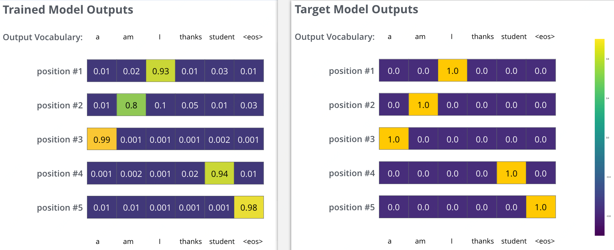

# 8. Seq2Seq & Attention & Transformer

## 8.1 Overview

**Keywords**: Attention, HAN, Transformer

## 8.2 Seq2Seq & Encoder2Decoder

#### Paper

- [Convolutional Sequence to Sequence Learning - Facebook2017](https://arxiv.org/abs/1705.03122)

    ConvS2S：使用CNN创建Seq2Seq模型，Encoder有15层CNN，覆盖输入长度为25

#### Practice

- [Play couplet with seq2seq model. 用深度学习对对联](https://github.com/wb14123/seq2seq-couplet) (Tensorflow)

- [从《Convolutional Sequence to Sequence Learning》到《Attention Is All You Need》 - 2018](https://zhuanlan.zhihu.com/p/27464080)

- [Convolutional Sequence to Sequence Learning - 2019](https://dzapathy.github.io/2019/02/14/fairseq/)

## 8.3 Attention

### 8.3.1 Overview

通俗来讲：对于某时刻的输出$Y_j$，它在输入$X$各timestep上的注意力，注意力是表示各输入$X_i$对某时刻$Y_j$贡献大小的权重。

貌似有3种：**正常的有X和Y的Attention，只有X的Attention，只有X的Self-Attention**  TODO TODO TODO

以下存疑，待完善！！！

Attention的打分机制是关键，表示**关键信息Key(to be matched)$k_i$和目标相关的查询Query(to match others)$q_j$之间**的匹配程度，有多种：

- General：$score(k_i, q_j)=k_i^TW_aq_j$

- Dot-Product：$score(k_i, q_j)=k_i^Tq_j$

- Scaled Dot-Product：$score(k_i, q_j)=k_i^Tq_j/\sqrt{d}$

- Additive：$score(k_i, q_j)=v_a^Ttanh(W_kk_i+W_qq_j)$

**YAO**: 

有时候在一些模型结构中可简化，比如**没有s只有a**，把a输入至一个小神经网络里得到a的权重，表示关于a的Attention，随后便可与a加权求和，结果可继续输入后续结构中。

Attention是一种理念和思想，核心要点在于：**通过小神经网络计算关于输入a的权重p(a)，即Attention**，从而后续结构在使用a时能够加权使用，有所侧重。

依据这一思想，Attention-based模型可以有很多种，可以很简单。

**YAO**: 本质上非常简单，可以表示为：**X-->Attention-->sum(p(X)\*X)**，Attention是一种加权求和，有各种方法，对应着不同的权重或概率p(X)

#### Paper

- [An Attentive Survey of Attention Models - LinkedIn2019](https://arxiv.org/abs/1904.02874)

    从4个方面对Attention分类：Number of Sequences, Number of Abstraction Levels, Number of Positions, Number of Representations.

#### Article

- 【Great】[Attention注意力机制超全综述 - 2019](https://mp.weixin.qq.com/s?__biz=MzI3ODgwODA2MA==&mid=2247486941&idx=2&sn=53d0a7b224cc8717047fb6eba6e1c368)

    **YAO**: 6种打分机制, Attention发展历程(Attention in Seq2Seq, SoftAttention, HardAttention, GlobalAttention, LocalAttention, Attention in Transformer), 实例分析, 机制实现分析

- 【Great】[深度学习中的注意力模型（2017版）](https://zhuanlan.zhihu.com/p/37601161)

    **YAO**: HERE HERE HERE

    

- [从各种注意力机制窥探深度学习在NLP中的神威](https://mp.weixin.qq.com/s?__biz=MzI3ODgwODA2MA==&mid=2247485751&idx=1&sn=4a76c7864f09b13764b0e9a6108a5a56)

- [目前主流的attention方法都有哪些？ - 2019](https://www.zhihu.com/question/68482809)

- [遍地开花的 Attention ，你真的懂吗？ - 2019](https://mp.weixin.qq.com/s?__biz=MzIzOTU0NTQ0MA==&mid=2247491048&idx=1&sn=ceb1cd0fecad478a252b7681ed3231d4)

### 8.3.2 Attention

[Neural Machine Translation by Jointly Learning to Align and Translate - Germany2014](https://arxiv.org/abs/1409.0473)

**YAO**: 经典的Encoder-Decoder机器翻译，使用的打分机制是**Additive**：$score(a_i, h_t)=v^atanh(W^aa_i+W^hh_t)$，其实就是A Single-layer MLP

#### Code

- <https://github.com/tensorflow/nmt> (Tensorflow)

- <https://github.com/brightmart/text_classification> (Tensorflow)

- <https://github.com/Choco31415/Attention_Network_With_Keras> (Keras)

    **YAO**: **Additive模型**，与吴恩达课程练习5-3-1里的Attention实现方式差不多

- [基于Keras的attention实战](https://blog.csdn.net/jinyuan7708/article/details/81909549)

    **YAO**: 大道至简，2种简单的另类Attention。好像说是：输入(或经简单处理如LSTM处理后)为inputs，inputs输入全连接层(小神经网络)，结果就是Attention，随后与inputs Merge在一起(Merge方式有很多)，再进行后续操作。这就是Attention-Based模型了！？！？

#### Article

- [Visualizing A Neural Machine Translation Model (Mechanics of Seq2seq Models With Attention)](https://jalammar.github.io/visualizing-neural-machine-translation-mechanics-of-seq2seq-models-with-attention/)

    以经典的Encoder-Decoder机器翻译为示例，讲解Encoder的状态A与Decoder的状态H之间的Attention关系

- [Attention and Memory in Deep Learning and NLP](http://www.wildml.com/2016/01/attention-and-memory-in-deep-learning-and-nlp/)

- [斯坦福 CS224n 课程对 Attention 机制的介绍 from 1:00:55](https://www.youtube.com/watch?v=XXtpJxZBa2c)

### 8.3.3 Hierarchical Attention Network (HAN)

HAN: [Hierarchical Attention Networks for Document Classification - CMU2016](https://www.cc.gatech.edu/~dyang888/docs/naacl16.pdf)

Structure: Word Encoder(BiGRU) -> Word Attention -> Sentence Encoder(BiGRU) -> Sentence Attention -> Softmax

共有Word和Sentence这2种level的 Encoder(To get rich representation of word/sentence) + Attention(To get important word/sentence among words/sentences)

引述论文：Uw is word-level context vector, and can be seen as a high level representation of a fixed query "what is the informative word" over the words. It's **randomly initialized and jointly learned** during the training process. Uw可以表示重要的词特征，通过计算**Uw与X(word经encoder之后的结果)的相似度**来度量word的重要性。Us与之同理，表示重要的句子特征。

上图所示的实现方法中使用了Keras中的TimeDistributed，参考[Github](https://github.com/ShawnyXiao/TextClassification-Keras#6-han)

**YAO**:

- 巧妙之处：受Attention启发，这种结构不仅可以获得Sentence中哪些words较为重要，而且可获得document中哪些sentences较为重要！It enables the model to capture important information in different levels. **在字、词、句子粒度上层次化文本，十分符合人类直觉**。

- 划分Sentence：一般通过句号、问号、感叹号来划分句子。对于脱敏数据，一般**频次第2高的几乎都是句号**，第1高的是逗号，可以大胆用第2高频词来划分。

- 与ELMo拼接：可以尝试**拼接Word2Vec和EMLo**，即Word2Vec和EMLo分别走Embedding-->Word-BiLSTM-->Self-Attention后向量拼接，然后走Sentence-BiLSTM-->Self-Attention-->MLP

#### Code

- 参考 10-Text_Classification.md，搜索"TextHAN"

- <https://github.com/richliao/textClassifier> (Keras)

    三个模型：TextHAN, TextCNN, BiLSTM + Attention

- <https://github.com/indiejoseph/doc-han-att> (Tensorflow)

### 8.3.4 BahdanauAttention & LuongAttention

#### Paper

- LuongAttention: [Effective Approaches to Attention-based Neural Machine Translation - Stanford2015](https://arxiv.org/abs/1508.04025)

    **YAO**: 貌似使用得较多，TF里有现成的API. Attention打分机制提到了4种：**双线性模型general, 点积模型dot，最初的加性模型concat**以及location-based Attention时**只使用Target Hidden State**(而没有Source Hidden State)，待继续……

- BahdanauAttention: [Neural Machine Translation by Jointly Learning to Align and Translate - Germany2016](https://arxiv.org/abs/1409.0473)

    与LuongAttention长得略微有点不同，但是功能一样。

- Normed BahdanauAttention: [Weight Normalization: A Simple Reparameterization to Accelerate Training of Deep Neural Networks - OpenAI2016](https://arxiv.org/abs/1602.07868)

    在BahdanauAttention类中有一个权重归一化的版本（normed_BahdanauAttention），它可以加快随机梯度下降的收敛速度。在使用时，将初始化函数中的参数normalize设为True即可。

### 8.3.5 单调 & 混合 Attention

[Online and Linear-Time Attention by Enforcing Monotonic Alignments - 2017](https://arxiv.org/abs/1704.00784)

    单调注意力机制(Monotonic Attention)，是在原有注意力机制上添加了一个单调约束。该单调约束的内容为：已经被关注过的输入序列，其前面的序列中不再被关注。

[Attention-Based Models for Speech Recognition - Poland2015](https://arxiv.org/abs/1506.07503)

    混合注意力机制很强大，比一般的注意力专注的地方更多，信息更丰富。因为混合注意力中含有位置信息，所以它可以在输入序列中选择下一个编码的位置。这样的机制更适用于输出序列大于输入序列的Seq2Seq任务，例如语音合成任务。

## 8.4 Transformer

其实就是 Seq2Seq + Attention Model with SelfAttention

### 8.4.1 Transformer

- [Attention Is All You Need - Google2017](https://arxiv.org/abs/1706.03762)

- [Training Tips for the Transformer Model - Czechia2018](https://arxiv.org/abs/1804.00247)

    训练 Transformer 时会发生的各种现象   推荐阅读！

#### Code

- [The Annotated Transformer - 2018](http://nlp.seas.harvard.edu/2018/04/03/attention.html) (PyTorch)

- <https://github.com/jadore801120/attention-is-all-you-need-pytorch> (PyTorch)

- <https://github.com/foamliu/Self-Attention-Keras> (Keras)

- <https://github.com/Kyubyong/transformer> (Tensorflow)

#### Library

- <https://github.com/CyberZHG/keras-transformer> (Keras)

- <https://github.com/CyberZHG/keras-self-attention> (Keras)

#### Article

- 【Great】[放弃幻想，全面拥抱Transformer：自然语言处理三大特征抽取器（CNN/RNN/TF）比较 - 2019](https://zhuanlan.zhihu.com/p/54743941)

    **YAO**: OK

    从NLP领域的特征抽取角度来说，Transformer会逐步取代RNN成为最主流的特征抽取器，CNN如果改造得当，还有一席之地。

    NLP任务的特点：**一维线性序列，不定长，相对位置很重要，长距离特征很关键**。模型改进的方向，就是让它更匹配NLP领域的这些特点。

    特征抽取器是否具备**长距离特征捕获能力**对于解决NLP任务是很关键的。

    NLP四大类任务：序列标签(分词/NER/POS/语义标注)，分类任务(情感分析/文本分类)，句子关系判断(QA/Entailment/文本推理)，生成式任务(机器翻译/文本摘要/看画说话)

    **RNN**:

    RNN本身线性序列结构在反向传播时因路径太长导致优化困难(梯度消失或爆炸)，为此引入LSTM/GRU，通过增加中间状态直接向后传播，以缓解梯度消失问题，成为RNN的标准模型。后来引入的Encoder-Decoder框架和Attention机制，极大拓展了RNN的能力和效果。RNN之前占据主导地位，主要原因是因为它的**结构天然适配NLP任务的特点**(RNN本身就是个可接纳不定长输入序列的由前向后线性传导信息的结构)。

    RNN现在面临2个严重问题：Transformer或经过改造的CNN，其应用效果明显优于RNN；RNN本身的**序列依赖结构不利于大规模并行计算**。目前解决无法并行计算的办法有2种：

    - 方法1：若每个timestep的隐层有多个神经元，t时刻的某个隐层神经元只与t-1时刻对应层的神经元有连接，断开与其他神经元的全连接（在说DeepRNN吗？DeepRNN好像本来也不是全连接啊？另外同一时刻各神经元也有依赖啊？），每层是一路，可以并行，每层内部仍保留前后依赖关系。这种方法并行能力上限很低，受隐层神经元数量影响，且仍然存在序列依赖。

    - 方法2：部分断开隐层之间的连接，比如每隔2个timestep断开1次，即**由x1->x2->x3->x4->x5->x6变成x1->x2,x3->x4,x5->x6**，然后通过加深层级，在后面层级上建立远距离特征之间的联系。但这其实就是简化版的TextCNN模型，速度又比CNN慢。

    **CNN**:

    最早将CNN引入NLP的工作是TextCNN，用于文本分类任务，结构简洁且与RNN模型效果相当，但在文本分类之外的任务领域，远远不如RNN模型。

    TextCNN运作机制：CNN捕获到的特征基本都体现在那个长度为k的滑动窗口里，它捕获的是**单词的k-gram片段信息**，k的大小决定了能捕获多远距离的特征。
    
    TextCNN有2个严重问题：一是**单层CNN无法捕获远距离特征**，目前解决办法有2种：

    - 方法1：仍是单层CNN，滑动窗口仍是k=3，窗口覆盖区域由连续区域改为**跳着覆盖**，即由覆盖(x1,x2,x3)变成覆盖(x1,x3,x5)，此为Dilated CNN的思想。

    - 方法2：由**单层CNN变成多层CNN**，在后面层捕获远距离特征，第1层只捕获(x1,x2,x3)的话，第2层可捕获((x1,x2,x3),(x2,x3,x4),(x3,x4,x5))的信息，距离为5，继续叠加CNN层的话能捕获的距离会越来越大，此是主流发展方向。但现实无情，人们发现，CNN做到2到3层后，网络加深对效果帮助不大。不是深层没用，而是**深层网络参数优化的方法不足**导致的。后来考虑把Skip Connection和各种Norm等参数优化技术引入，才能慢慢把CNN深度做起来。

    问题2是**MaxPooling层会导致位置信息舍弃**：CNN捕获的特征是有位置信息的，但如果后面立马接MaxPooling的话，由于它只选中并保留最强的那个特征，位置信息就扔掉了。
    
    现在NLP领域，CNN的一个发展趋势和主流方向是：不用Pooling层，**使用Conv1D叠加网络深度，同时使用Skip Connectiont来辅助优化**。这种理念的模型有ConvS2S, TCN等。

    关于位置编码，CNN的滑动窗口从左到右滑动，捕获的特征在结构上是有相对位置信息的，不需要额外的Positional Embedding，当然也可以给每个单词增加一个，与单词的词向量叠加在一起形成单词输入，这也是常规做法，另外CNN的并行计算能力非常强。

    CNN进化总结：想方设法把CNN的深度做起来，随着深度的增加，很多看似无关的问题随之解决了。

    **Transformer**:

    Transformer不像RNN或CNN，必须明确的在输入端将Positon信息编码，Transformer是用位置函数来进行位置编码的，而Bert等模型给每个单词一个Position embedding，将单词embedding和对应的position embedding加起来形成单词的输入embedding，类似ConvS2S。

    **RNN VS CNN VS Transformer**:

    从以下几个角度进行对比，模型分别是RNNS2S, ConvS2S, Transformer：

    - 句法特征提取能力：**原生RNN < 原生CNN**，暂时没有Transformer的对比

    - 语义特征提取能力：**Transformer >> 原生RNN == 原生CNN**  在考察语义能力的任务(比如机器翻译？)中，Transformer超过RNN和CNN大约4-8个绝对百分点。
    
    - 长距离特征捕获能力：**Transformer > 原生RNN >> 原生CNN**  在该类任务(主语-谓语一致性检测，比如we……..are…)，当主谓距离<13时，Transformer微弱优于RNN，当距离>13时，Transformer微弱弱于RNN，综合看可以认为Transformer和RNN在这方面能力差不多，而CNN则显著弱于前两者。对于Transformer来说，Multi-head attention的head数量严重影响Long-range特征捕获能力，head越多越有利于捕获long-range特征。

    - 任务综合特征抽取能力：**Transformer >> 原生RNN == 原生CNN**  原生CNN略微比原生RNN稍微好一点  NLP中最具代表性的任务是机器翻译，它基本上是对NLP各项处理能力综合要求最高的任务之一，对句法、语义、上下文、长距离特征等都需要考察。

    - 并行计算能力：**Transformer == 原生CNN >> 原生RNN**

    - 计算复杂度和效率：**SelfAttention=$O(T^2D)$, RNN=$O(TD^2)$, CNN=$O(KTD^2)$**，三者都包含平方项，取决于D和T谁的平均值大，T是sequence length，D是representation dimension，K是kernel size of CNN。一般情况下，句子平均长度T都小于词向量维度D时，SelfAttention计算量要小于RNN和CNN，反之大于RNN和CNN。但是如果考虑到并行计算，对于Transformer和CNN，那个T是可以通过并行计算来消除的，情况就不一样了。有些论文证明：在训练和在线推理方面，CNN比RNN快9.3倍到21倍；Transformer和CNN训练速度比双向LSTM快3到5倍；Transformer Base速度最快，CNN速度次之，但是比Transformer Base慢了将近一倍，Transformer Big速度再次，因为它的参数量最大，而最慢的是RNN，比前两者慢了3倍到几十倍。

        其实从复杂度可以看出Transformer的一个缺点：当任务输入是篇章级别(如文本摘要)时，**输入很长，即T很大，Transformer会有巨大的计算复杂度$O(T^2D)$，导致速度急剧变慢**，所以短期内这些领域还是RNN或长成Transformer的CNN合适，尤其是CNN。Transformer的解决办法：长输入强制性切为多份，分别输入Transformer，高层再合并，比如Transformer-XL

    - 综合排序：**Transformer > CNN > RNN**，从速度和效果折衷的角度看，对于工业界应用，在特征抽取方面，**推荐Transformer-base**

    **三者合流**:

    基本思路：把CNN/RNN成为Transformer的一个构件。比如，**把SelfAttention用BiRNN或CNN替代**，其他构件不变。

    合流效果：机器翻译的BLEU得分上，某论文有如下结论：
    
    - Transformer=25.4
    - 原生RNN=23.2, 原生RNN+multihead=23.7, +position=23.9, +norm=23.7, +multiattention=24.5, +feedforward=25.1，可知RNN在合流过程中效果不断提升，但与Transformer还是有一定差距
    - 原生CNN=23.6, 原生CNN+norm=24.3, +multihead=24.2, +feedforward=25.3，可知与RNN类似，合流中效果不断提升，但与Transformer也还是有一定差距
    - 说明：Transformer之所有效果这么好，不仅仅是multihead attention在发生作用，而是**几乎所有构件都在共同发挥作用，是一个小的系统工程**。而CNN/RNN唯一出路在于寄生在Transformer Block里

- 【Great】[The Illustrated Transformer - 2018](https://jalammar.github.io/illustrated-transformer/)

    **Chinese**: [The Illustrated Transformer【译】](https://blog.csdn.net/yujianmin1990/article/details/85221271)

    **YAO**: OK

    **SelfAttention**

    $a^{1,i}=q^1k^i/\sqrt{dim(k^i)}$作为一个分数，决定着编码$x^1$时（某个固定位置时），每个输入词(x1,x2,...,xn)需要集中多少注意力，是**各输入$x^i$自己跟自己**的注意力关系。

    SelfAttention输入输出的矩阵运算关系：

    

    **Transformer**
    
    以左右各2个Encoders/Decoders示例

    

    **Encoders**
    
    有多个Encoder(比如6个)，结构相同但不共享参数，**所有timestep的输入同时输入Encoders，同时流通整个Encoders，并同时输出**
    
    - 每个Encoder内：**Input -> SelfAttention + Residual -> Add & Norm -> FeedForwards + Residual -> Add & Norm -> Output**

      - SelfAttention里各输入两两依赖(以计算Attention)
      - FeedForwards中没有这些依赖性(**TODO**: SelfAttention的各个输出在FeedForwards中不共享参数？每个输出对应一个独立的FeedForward?)！
      - Add & Norm用于先Add来自SelfAttention或FeedForward的输入与输出然后进行Layer Normalization

    - 各个Encoder间：首尾相连，前一Encoder的Output是后一Encoder的Input，最后1个Encoder的Output(被转换为**K和V**)才输入到Transformer右半部分，且输入到每个Decoder的**Encoder-Decoder Attention**中，以帮助Decoder集中于输入序列的合适位置！

    **Decoders**
    
    有多个Decoder(比如6个)，每个timestep的输入单独输入Decoders，**待前1个timestep的输入流通整个Decoders并输出后，后1个timestep的输入才开始**，并且要使用前1个timestep的输出

    - 每个Decoder内：**Input -> Masked SelfAttention + Residual -> Add & Norm -> Encoder-Decoder Attention + Residual -> Add & Norm -> FeedForwards + Residual -> Add & Norm -> Output**

      - Input: 第1个Decoder的Input也需要增加Positional信息
      - Masked SelfAttention: **它的Key/Query/Value均来自前一层**，同时**只关注之前各timestep，后面的timestep被mask**，即：在预测第t个词时把t+1到末尾的词遮住，只对前面t个词做Self Attention
      - Encoder-Decoder Attention：工作方式同Multi-head SelfAttention，但是它的输入中，**Key和Value来自Encoders最后的输出，只有Query来自前一层Add & Norm层**

    **Linear & Softmax**
    
    inear将Deocders每一timestep的输出映射为一个非常大的logits向量，每个值表示某个词的可能倾向值，随后Softmax将这些值转换为概率值log_probs。

    **Training**
    
    模型每一timestep的输出是1个概率分布(长度为|Vocab|的一维向量)，与目标概率分布之间的Loss采用**Cross-Entropy或KL散度**。如下所示，当考虑所有timesteps时，右边是训练模型的目标概率分布，左边是实际输出的概率分布。

    

    **Inference**
    
    有2种解码方法：**Greedy解码和Beam Search**，前者是每一timestep只保留概率最大的，扔掉其他部分，后者是每一timestep保留最大的K个部分，根据这K个部分再预测下一timestep，K是超参数。

- [Transformer: A Novel Neural Network Architecture for Language Understanding - 2017](https://ai.googleblog.com/2017/08/transformer-novel-neural-network.html)
  
- [Google 发布的 attention 机制介绍官方视频](https://www.youtube.com/watch?v=rBCqOTEfxvg)

- [Transformer (变形金刚，大雾) 三部曲：RNN 的继承者 - 2019](https://mp.weixin.qq.com/s?__biz=MjM5ODkzMzMwMQ==&mid=2650411699&idx=3&sn=83286bfa620ebe7297759fb78c31286c)

    **YAO**:

    输入序列X与输出序列Y之间的Attention其实有3种：**X内部($X_i$与$X_j$的Attention)，Y内部($Y_i$与$Y_j$的Attention)，X与Y之间($X_i$与$Y_j$的Attention)**

    经典架构RNN+Seq2Seq+Attention只侧重于X与Y之间的Attention，X内部和Y内部仍然使用RNN，而Transformer通过SelfAttention侧重X内部和Y内部的Attention，通过Encoder-Decoder Attention来侧重X与Y之间的Attention。

    TODO 继续……

- [Attention机制详解（二）——Self-Attention与Transformer - 2019](https://zhuanlan.zhihu.com/p/47282410)

- [李宏毅机器学习2019之P60-Transformer - 2019](https://www.bilibili.com/video/av46561029/?p=60)

    **YAO**: OK
    
    Self-Attention可以替代所有RNN做的事情

    Self-Attention机理：输入为$I$，则 **$Q=W^qI$, $K=W^kI$, $V=W^vI$**，分别表示 Query(to match others), Key(to be matched), Value(extracted from I)，然后Attention为 **$A=K^TQ$**，经softmax后为 $\hat{A}$，最后输出为 **$O=V\hat{A}$**，全是矩阵运算，可并行处理。写在一起为：

    $$O=(W^vI)softmax((W^kI)^T(W^qI)/\sqrt{dim(K)})$$

    Self-Attention可以是**Multi-head**的，即$a^i$可以有不止一组的<$q^i$,$k^i$,$v^i$>，各组用于集中不同位置以表征不同的特征，比如有些用于抓取Local信息，有些用于抓取相对全局的信息，等等。相应地，输出$O_i$也有多个，拼接在一起，需再乘以矩阵$W^o$为最终的输出$O$

    Self-Attention没有Positional信息，为此让每个$a^i$直接加上一个表示Positional信息的$e^i$，代替原来的$a^i$，$e^i$是事先指定的，而非Learned from data。
    
    (解释：$p^i$是i处为1其余为0的onehot向量，使其与$x^i$拼接，则 **$W[x^i;p^i]^T=[W_I,W_p][x^i;p^i]^T=W_Ix^i+W_pp^i=a^i+e^i$**，所以$e^i$与$a^i$直接相加，就是$p^i$与$x^i$拼接)

    Seq2Seq模型中的Encoder和Decoder，都可以用Self-Attention来代替其中的RNN，即为Transformer。

    **TODO** 疑问：**Transformer-Decoders是并行么**？当前timestep在处理时需要上一timestep的output作为输入，所以**每个timestep内是并行，各timestep之间是串行**。

#### Pratice
  
- 【Great】[Step-by-step to Transformer：深入解析工作原理（以Pytorch机器翻译为例） - 2019](https://mp.weixin.qq.com/s?__biz=MzIwNzc2NTk0NQ==&mid=2247485185&idx=1&sn=6d33a07715e5c8247b968cceaa7ae322)

- [使用一个简单的 Transformer 模型进行序列标注](https://medium.com/@kolloldas/building-the-mighty-transformer-for-sequence-tagging-in-pytorch-part-i-a1815655cd8)

- [一个写对联的 Transformer 序列到序列模型 - 2019](https://github.com/andy-yangz/couplets_seq2seq_transformer) (Tensorflow)

    **Article**：[为了写春联，我用Transformer训练了一个“对穿肠”](https://mp.weixin.qq.com/s?__biz=MjM5MTQzNzU2NA==&mid=2651667456&idx=1&sn=b2ffe9990f8bf8a242e52face2044b65)

- [Keras实现Self-Attention文本分类 - 2019](https://blog.csdn.net/xiaosongshine/article/details/90600028)

### 8.4.2 Transformer-XL

[Transformer-XL: Attentive Language Models Beyond a Fixed Length Context - Google2019](https://arxiv.org/abs/1901.02860)

该模型对 Transformer 进行了改进，但这一改进没有被 BERT 采用

#### Code

- <https://github.com/CyberZHG/keras-transformer-xl> (Keras)

- <https://github.com/kimiyoung/transformer-xl/tree/master/pytorch> (PyTorch)

- <https://github.com/kimiyoung/transformer-xl/tree/master/tf> (Tensorflow)

#### Article

- [Transformer-XL — CombiningTransformers and RNNs Into a State-of-the-art Language Model - 2019](https://www.lyrn.ai/2019/01/16/transformer-xl-sota-language-model)
