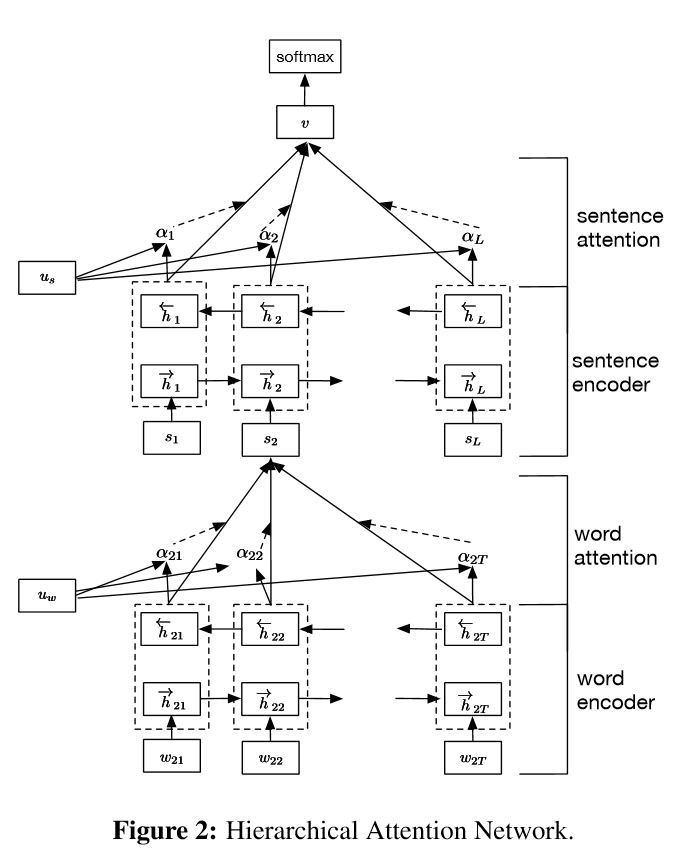

# 8. Seq2Seq & Attention & Transformer

## 8.1 Overview

**Keywords**: Attention, HAN, Transformer

## 8.2 Seq2Seq & Encoder2Decoder

#### Practice

- [Play couplet with seq2seq model. 用深度学习对对联](https://github.com/wb14123/seq2seq-couplet) (Tensorflow)

## 8.3 Attention

### 8.3.1 Overview

通俗来讲：对于某时刻的输出$Y_j$，它在输入$X$各timestep上的注意力，注意力是表示各输入$X_i$对某时刻$Y_j$贡献大小的权重。

貌似有3种：**正常的有X和Y的Attention，只有X的Attention，只有X的Self-Attention**  TODO TODO TODO

以下存疑，待完善！！！

Attention的打分机制是关键，表示**关键信息Key(to be matched)$k_i$和目标相关的查询Query(to match others)$q_j$之间**的匹配程度，有多种：

- General：$score(k_i, q_j)=k_i^TW_aq_j$

- Dot-Product：$score(k_i, q_j)=k_i^Tq_j$

- Scaled Dot-Product：$score(k_i, q_j)=k_i^Tq_j/\sqrt{d}$

- Additive：$score(k_i, q_j)=v_a^Ttanh(W_kk_i+W_qq_j)$

**YAO**: 

有时候在一些模型结构中可简化，比如**没有s只有a**，把a输入至一个小神经网络里得到a的权重，表示关于a的Attention，随后便可与a加权求和，结果可继续输入后续结构中。

Attention是一种理念和思想，核心要点在于：**通过小神经网络计算关于输入a的权重p(a)，即Attention**，从而后续结构在使用a时能够加权使用，有所侧重。

依据这一思想，Attention-based模型可以有很多种，可以很简单。

**YAO**: 本质上非常简单，可以表示为：**X-->Attention-->sum(p(X)\*X)**，Attention是一种加权求和，有各种方法，对应着不同的权重或概率p(X)

#### Paper

- [An Attentive Survey of Attention Models - LinkedIn2019](https://arxiv.org/abs/1904.02874)

    从4个方面对Attention分类：Number of Sequences, Number of Abstraction Levels, Number of Positions, Number of Representations.

#### Article

- 【Great】[Attention注意力机制超全综述 - 2019](https://mp.weixin.qq.com/s?__biz=MzI3ODgwODA2MA==&mid=2247486941&idx=2&sn=53d0a7b224cc8717047fb6eba6e1c368)

    **YAO**: 6种打分机制, Attention发展历程(Attention in Seq2Seq, SoftAttention, HardAttention, GlobalAttention, LocalAttention, Attention in Transformer), 实例分析, 机制实现分析

- [从各种注意力机制窥探深度学习在NLP中的神威](https://mp.weixin.qq.com/s?__biz=MzI3ODgwODA2MA==&mid=2247485751&idx=1&sn=4a76c7864f09b13764b0e9a6108a5a56)

- [目前主流的attention方法都有哪些？ - 2019](https://www.zhihu.com/question/68482809)

- [遍地开花的 Attention ，你真的懂吗？ - 2019](https://mp.weixin.qq.com/s?__biz=MzIzOTU0NTQ0MA==&mid=2247491048&idx=1&sn=ceb1cd0fecad478a252b7681ed3231d4)

### 8.3.2 Attention

[Neural Machine Translation by Jointly Learning to Align and Translate - Germany2014](https://arxiv.org/abs/1409.0473v2)

**YAO**: Attention打分机制使用的是**加性模型**

#### Code

- <https://github.com/tensorflow/nmt> (Tensorflow)

- <https://github.com/brightmart/text_classification> (Tensorflow)

- <https://github.com/Choco31415/Attention_Network_With_Keras> (Keras)

    **YAO**: **加性模型**，与吴恩达课程练习5-3-1里的Attention实现方式差不多

- [基于Keras的attention实战](https://blog.csdn.net/jinyuan7708/article/details/81909549)

    **YAO**: 大道至简，2种简单的另类Attention。
    
    **YAO**: 好像说是：输入(或经简单处理如LSTM处理后)为inputs，inputs输入全连接层(小神经网络)，结果就是Attention，随后与inputs Merge在一起(Merge方式有很多)，再进行后续操作。这就是Attention-Based模型了！？！？

#### Article

- [Visualizing A Neural Machine Translation Model (Mechanics of Seq2seq Models With Attention)](https://jalammar.github.io/visualizing-neural-machine-translation-mechanics-of-seq2seq-models-with-attention/)

- [Attention and Memory in Deep Learning and NLP](http://www.wildml.com/2016/01/attention-and-memory-in-deep-learning-and-nlp/)

- [斯坦福 CS224n 课程对 Attention 机制的介绍 from 1:00:55](https://www.youtube.com/watch?v=XXtpJxZBa2c)

### 8.3.3 Hierarchical Attention Network (HAN)

HAN: [Hierarchical Attention Networks for Document Classification - CMU2016](https://www.cc.gatech.edu/~dyang888/docs/naacl16.pdf)

Structure: Word Encoder(BiGRU) -> Word Attention -> Sentence Encoder(BiGRU) -> Sentence Attention -> Softmax

共有Word和Sentence这2种level的 Encoder(To get rich representation of word/sentence) + Attention(To get important word/sentence among words/sentences)

引述论文：Uw is word-level context vector, and can be seen as a high level representation of a fixed query "what is the informative word" over the words. It's **randomly initialized and jointly learned** during the training process. Uw可以表示重要的词特征，通过计算**Uw与X(word经encoder之后的结果)的相似度**来度量word的重要性。Us与之同理，表示重要的句子特征。

上图所示的实现方法中使用了Keras中的TimeDistributed，参考[Github](https://github.com/ShawnyXiao/TextClassification-Keras#6-han)

**YAO**:

- 巧妙之处：受Attention启发，这种结构不仅可以获得Sentence中哪些words较为重要，而且可获得document中哪些sentences较为重要！It enables the model to capture important information in different levels. **在字、词、句子粒度上层次化文本，十分符合人类直觉**。

- 划分Sentence：一般通过句号、问号、感叹号来划分句子。对于脱敏数据，一般**频次第2高的几乎都是句号**，第1高的是逗号，可以大胆用第2高频词来划分。

- 与ELMo拼接：可以尝试**拼接Word2Vec和EMLo**，即Word2Vec和EMLo分别走Embedding-->Word-BiLSTM-->Self-Attention后向量拼接，然后走Sentence-BiLSTM-->Self-Attention-->MLP

#### Code

- 参考 10-Text_Classification.md，搜索"TextHAN"

- <https://github.com/richliao/textClassifier> (Keras)

    三个模型：TextHAN, TextCNN, BiLSTM + Attention

- <https://github.com/indiejoseph/doc-han-att> (Tensorflow)

### 8.3.4 BahdanauAttention & LuongAttention

#### Paper

- LuongAttention: [Effective Approaches to Attention-based Neural Machine Translation - Stanford2015](https://arxiv.org/abs/1508.04025)

    **YAO**: 貌似使用得较多，TF里有现成的API. Attention打分机制提到了4种：**双线性模型general, 点积模型dot，最初的加性模型concat**以及location-based Attention时**只使用Target Hidden State**(而没有Source Hidden State)，待继续……

- BahdanauAttention: [Neural Machine Translation by Jointly Learning to Align and Translate - Germany2016](https://arxiv.org/abs/1409.0473)

    与LuongAttention长得略微有点不同，但是功能一样。

- Normed BahdanauAttention: [Weight Normalization: A Simple Reparameterization to Accelerate Training of Deep Neural Networks - OpenAI2016](https://arxiv.org/abs/1602.07868)

    在BahdanauAttention类中有一个权重归一化的版本（normed_BahdanauAttention），它可以加快随机梯度下降的收敛速度。在使用时，将初始化函数中的参数normalize设为True即可。

### 8.3.5 单调 & 混合 Attention

[Online and Linear-Time Attention by Enforcing Monotonic Alignments - 2017](https://arxiv.org/abs/1704.00784)

    单调注意力机制(Monotonic Attention)，是在原有注意力机制上添加了一个单调约束。该单调约束的内容为：已经被关注过的输入序列，其前面的序列中不再被关注。

[Attention-Based Models for Speech Recognition - Poland2015](https://arxiv.org/abs/1506.07503)

    混合注意力机制很强大，比一般的注意力专注的地方更多，信息更丰富。因为混合注意力中含有位置信息，所以它可以在输入序列中选择下一个编码的位置。这样的机制更适用于输出序列大于输入序列的Seq2Seq任务，例如语音合成任务。

## 8.4 Transformer - TOTODO

Seq2Seq Model with Self-attention

### 8.4.1 Transformer

- Transformer: [Attention Is All You Need - Google2017](https://arxiv.org/abs/1706.03762)

- [Training Tips for the Transformer Model - Czechia2018](https://arxiv.org/abs/1804.00247)

    训练 Transformer 时会发生的各种现象   推荐阅读！

#### Code

- [The Annotated Transformer - 2018](http://nlp.seas.harvard.edu/2018/04/03/attention.html) (PyTorch)

- <https://github.com/jadore801120/attention-is-all-you-need-pytorch> (PyTorch)

- <https://github.com/foamliu/Self-Attention-Keras> (Keras)

- <https://github.com/Kyubyong/transformer> (Tensorflow)

#### Library

- <https://github.com/CyberZHG/keras-transformer> (Keras)

- <https://github.com/CyberZHG/keras-self-attention> (Keras)

#### Article

- 【Great】[放弃幻想，全面拥抱Transformer：自然语言处理三大特征抽取器（CNN/RNN/TF）比较 - 2019](https://zhuanlan.zhihu.com/p/54743941)

- 【Great】[BERT大火却不懂Transformer？读这一篇就够了 - 2019](https://mp.weixin.qq.com/s?__biz=MjM5MTQzNzU2NA==&mid=2651666707&idx=1&sn=2e9149ccdba746eaec687038ce560349)

- 【Great】[The Illustrated Transformer - 2018](https://jalammar.github.io/illustrated-transformer/)

    **Chinese**: [The Illustrated Transformer【译】](https://blog.csdn.net/yujianmin1990/article/details/85221271)

- [Transformer: A Novel Neural Network Architecture for Language Understanding - 2017](https://ai.googleblog.com/2017/08/transformer-novel-neural-network.html)
  
- [Google 发布的 attention 机制介绍官方视频](https://www.youtube.com/watch?v=rBCqOTEfxvg)

- [Transformer (变形金刚，大雾) 三部曲：RNN 的继承者 - 2019](https://mp.weixin.qq.com/s?__biz=MjM5ODkzMzMwMQ==&mid=2650411699&idx=3&sn=83286bfa620ebe7297759fb78c31286c)

- [Attention机制详解（二）——Self-Attention与Transformer - 2019](https://zhuanlan.zhihu.com/p/47282410)

- [李宏毅机器学习2019之P60-Transformer - 2019](https://www.bilibili.com/video/av46561029/?p=60)

    **YAO**:
    
    Self-Attention可以替代所有RNN做的事情

    Self-Attention机理：输入为$I$，则 $Q=W^qI$, $K=W^kI$, $V=W^vI$，分别表示 Query(to match others), Key(to be matched), Information(extracted from I)，然后Attention为 $A=K^TQ$，经softmax后为 $\hat{A}$，最后输出为 $O=V\hat{A}$

#### Pratice
  
- [使用一个简单的 Transformer 模型进行序列标注](https://medium.com/@kolloldas/building-the-mighty-transformer-for-sequence-tagging-in-pytorch-part-i-a1815655cd8)

- [一个写对联的 Transformer 序列到序列模型 - 2019](https://github.com/andy-yangz/couplets_seq2seq_transformer) (Tensorflow)

    **Article**：[为了写春联，我用Transformer训练了一个“对穿肠”](https://mp.weixin.qq.com/s?__biz=MjM5MTQzNzU2NA==&mid=2651667456&idx=1&sn=b2ffe9990f8bf8a242e52face2044b65)

- [Keras实现Self-Attention文本分类 - 2019](https://blog.csdn.net/xiaosongshine/article/details/90600028)

### 8.4.2 Transformer-XL

[Transformer-XL: Attentive Language Models Beyond a Fixed Length Context - Google2019](https://arxiv.org/abs/1901.02860)

该模型对 Transformer 进行了改进，但这一改进没有被 BERT 采用

#### Code

- <https://github.com/CyberZHG/keras-transformer-xl> (Keras)

- <https://github.com/kimiyoung/transformer-xl/tree/master/pytorch> (PyTorch)

- <https://github.com/kimiyoung/transformer-xl/tree/master/tf> (Tensorflow)

#### Article

- [Transformer-XL — CombiningTransformers and RNNs Into a State-of-the-art Language Model - 2019](https://www.lyrn.ai/2019/01/16/transformer-xl-sota-language-model)
