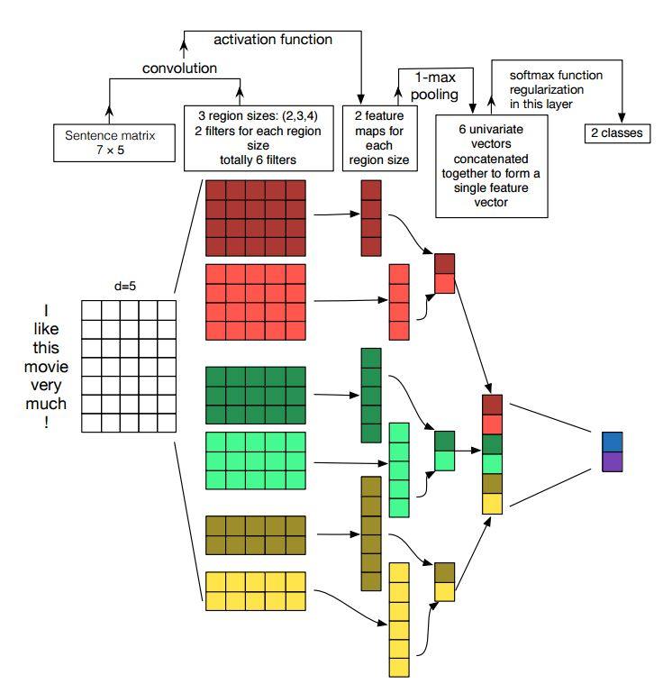
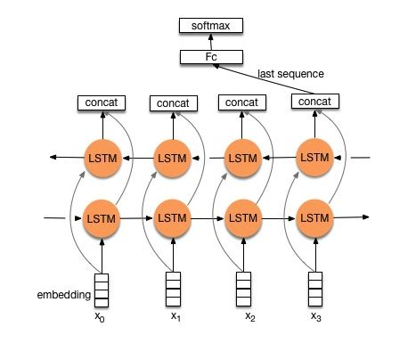
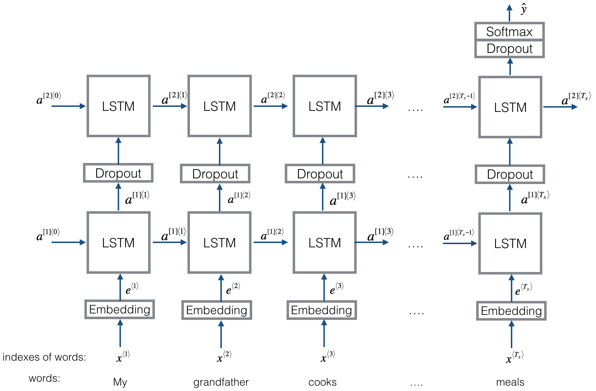
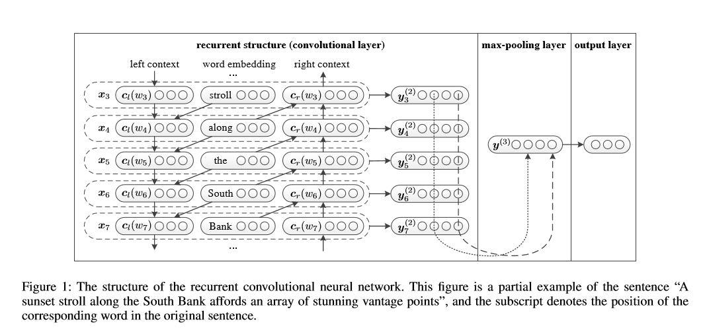

# 10. Text Classification

YAO's: <https://github.com/liuyaox/text_classification> (Keras & PyTorch)

## 10.1 Overview

#### Paper

- [A Brief Survey of Text Mining: Classification, Clustering and Extraction Techniques - UGA2017](https://arxiv.org/abs/1707.02919)

- [Towards Explainable NLP: A Generative Explanation Framework for Text Classification - PKU2019](https://arxiv.org/abs/1811.00196)

    **Chinese**: [面向可解释的NLP：北大、哈工大等提出文本分类的生成性解释框架](https://mp.weixin.qq.com/s?__biz=MzI4MDYzNzg4Mw==&mid=2247489745&idx=5&sn=44e8bfeb5d9d9c1bb2906d941dfc063e)

- [Deep Learning Based Text Classification: A Comprehensive Review - Google2020](https://arxiv.org/abs/2004.03705)

    **Article**: [【Snapchat-谷歌-微软】最新《深度学习文本分类》2020综述论文大全，150+DL分类模型，42页pdf215篇参考文献](https://mp.weixin.qq.com/s/0tg87kxMZqdbWISElgEiJQ)

#### Library

- NeuralNLP-NeuralClassifier: <https://github.com/Tencent/NeuralNLP-NeuralClassifier>

    An Open-source Neural Hierarchical Multi-label Text Classification Toolkit from Tencent.

- THUCTC: <http://thuctc.thunlp.org/>

    一个高效的中文文本分类工具包，包含Data: 中文文本分类数据集THUCNews

#### Code

- 【Great】<https://github.com/yongzhuo/Keras-TextClassification> (Keras)

    中文长文本分类、短句子分类（Chinese Text Classification of Keras NLP, or sentence classify, long or short），字词句向量嵌入层（embeddings）和网络层（graph）构建基类
    
    模型：FastText, TextCNN，CharCNN，TextRNN, RCNN, DCNN, DPCNN, VDCNN, CRNN, Bert, Attention, DeepMoji, TextHAN(Transformer), CapsuleNet, Transformer-encode, Seq2seq, ENT, DMN

    **Article**: 【Great!】[中文短文本分类实例1-12](https://blog.csdn.net/rensihui)

- <https://github.com/ShawnyXiao/TextClassification-Keras> (Keras)

    Text classification models implemented in Keras, including: FastText, TextCNN, TextRNN, TextBiRNN, TextAttBiRNN, TextHAN, RCNN, RCNNVariant, etc.

    **YAO**: 亲测了TextHAN

- <https://github.com/AlexYangLi/TextClassification> (Keras)

    All kinds of neural text classifiers implemented by Keras: TextCNN, DCNN, RCNN, TextHAN, DPCNN, VDCNN, MultiTextCNN, BiLSTM, RNNCNN, CNNRNN.

    **YAO**: 亲测了TextHAN

- 【Great】<https://github.com/wabyking/TextClassificationBenchmark> (PyTorch)

    A Benchmark of Text Classification in PyTorch

    模型：FastText, BasicCNN(KimCNN, MultiLayerCNN, MultiPerspectiveCNN), InceptionCNN, LSTM(BiLSTM, StackLSTM), LSTM with Attention(Self Attention, Quantum Attention), Hybrids between CNN and RNN (RCNN, C-LSTM), Transformer, Capsule, Quantum-inspired NN

- 【Great】<https://github.com/649453932/Chinese-Text-Classification-Pytorch> (PyTorch)

    中文文本分类，TextCNN，TextRNN，FastText，TextRCNN，BiLSTM_Attention，DPCNN，基于pytorch，开箱即用

- <https://github.com/songyingxin/TextClassification-Pytorch> (PyTorch)

    Pytorch + NLP, 一份友好的项目实践仓库

- <https://github.com/brightmart/text_classification> (Tensorflow)

    模型：FastText, TextCNN, TextRNN, TextRCNN, BERT, TextHAN, Attention, Transformer, Dynamic Memory Network, EntityNetwork, BiLSTMTextRelation, TwoCNNTextRelation, BiLSTMTextRelationTwoRNN

- <https://github.com/brightmart/ai_law> (Tensorflow)

    All kinds of baseline models for long text classificaiton (text categorization): TextHAN, TextCNN, DPCNN, CNN-GRU, GRU-CNN, Simple Pooling, Transformer(todo)

- <https://github.com/Edward1Chou/Textclassification> (Tensorflow)

    分别构建基于传统机器学习(LR, RF)的文本分类和基于深度学习(CNN)的文本分类系统，并在同一数据集上进行测试。

- <https://github.com/jiangxinyang227/textClassifier> (Tensorflow)

    模型：TextCNN, CharCNN, BiLSTM, BiLSTM+Attention, TextRCNN, adversarialLSTM, Transformer, ELMo, BERT

- <https://github.com/pengming617/text_classification> (Tensorflow)

    模型：TextCNN，TextRNN, LEAM, Transformer，Attention, fasttext, TextHAN等


#### Practice

- [文本分类实战系列文章 - 2019](https://www.cnblogs.com/jiangxinyang/p/10207482.html) (Tensorflow)


#### Article

- 【Great】[用深度学习（CNN RNN Attention）解决大规模文本分类问题 - 综述和实践 - 2017](https://zhuanlan.zhihu.com/p/25928551)

    **YAO**: OK  综述，有传统方法和深度学习方法，还有经验思考
    
    业务任务：根据商品title预测其所属cid3，典型的**短文本多分类**问题。

    传统方法
    
    - 文本表示：词袋模型BoW或向量空间模型VSM、基于语义的文本表示如LDA/LSI/PLSI概率潜在语义索引等
    
    - 特征选择：基本思路是根据某个评价指标独立地对原始特征项（词项）进行评分排序，指标有文档频率、互信息、信息增益、卡方统计量等
    
    - 特征权重：TFIDF及其扩展方法

    深度学习方法
    
    - 分类模型：fastText, TextCNN, TextRNN, TextRNN+Attention, TextRCNN

    工程经验
    
    - 模型并不重要：TextCNN已经足以不错，RCNN只提升1%左右，建议**先用TextCNN把整体任务效果调试到最好，再尝试改进模型**
    
    - 一定要理解数据：数据Sense很重要，要**重视Badcase分析**，明白数据为什么Bad为什么Good
    
    - 搭建快速实验流程：事先搭建好一套流程，能够快速迭代模型，通俗来讲就是写好代码，改变参数后能够快速运行，并做好记录和分析
    
    - 超参数调节：推荐资料为[A Sensitivity Analysis of (and Practitioners’ Guide to) Convolutional Neural Networks for Sentence Classification](https://arxiv.org/abs/1510.03820)和[深度学习网络调参技巧](https://zhuanlan.zhihu.com/p/24720954)
    
    - 一定要用Dropout：除非有了BN，最好的参数还是0.5
    
    - Finetuning是必选的
    
    - 类目不均衡：如果Loss被一部分类别Dominate，对总体而言大多是负向的。建议尝试类似**Booststrap方法以调整Loss中样本权重**（How???）
    
    - 避免训练震荡：一定要增加随机采样使得数据独立同分布，默认Shuffle(fit的参数shuffle=True)机制能使训练结果更稳定。如果仍震荡，尝试**调整一下learning_rate或mini_batch_size**
    
    - 没有收敛前不要下结论：一定要等到Loss收敛了才能下结论

- 【Great】[在文本分类任务中，有哪些论文中很少提及却对性能有重要影响的tricks](https://www.zhihu.com/question/265357659/answer/578944550)

    **YAO**: OK

    - 数据预处理

      - 理念: 数据量足够大的情况下，**强行破坏数据分布**可能是无用功，比如清洗。但数据量较小或数据分布有偏时，要考验预处理的功底了。

      - vocab: 尝试过滤前N个高频词，以及次数少于3的低频词，或根据TFIDF值来筛选

      - stopword: 在公开停用词基础上，要根据具体任务增加或删除一些

      - 归一化: 必须要做的 ？？？

      - 数据增强: drop, shuffle, replace, 近义词, 扩充, 截取
      
      - 文本纠错、词干还原、形态还原、拼音处理可能会有用

      - 文本泛化: 表情、数字、人名、地址、网址、命名实体等，可用关键字代替，视具体的任务而定，也可单独作为一维特征

      - 分词工具：首先要确保分词器与预训练词向量表中的Token能够match，否则就是OOV了。若已知预训练词向量使用的分词工具，直接使用之；若不知，可尝试寻找，多试几个分词工具，分词结果与词向量最接近的即可。同时也要考虑大小写的处理是否一致。

      - 数据噪声的处理：一种是X内部噪声，比如口语化或互联网文本，可使用语言模型或基于编辑距离的文本纠错，然而实际上由于专有名词和超出想象的**假噪声**，实际效果并不很好；另一种是Y噪声，可强行跑模型，然后做Badcase分析，甚至直接把明显判错的样本纠正过来！当然最好是，如果数据量足够，直接删除这些样本。

    - 数据特征

      - meta-feature: 比如词性、情感以及各种语言学特征和元信息等，时好时坏，但有时对于**短文本分类**有神奇的效果！  **TODO**：如何加入这些元特征？？？

      - 英文有字符向量，中文有笔画向量，在某些场景上可能有效

      - 自己训练字词向量: 训练字向量时的窗口要比词向量时大一些，其他预训练超参也最好调一调。WHY?

      - **迁移特征**: 尝试用公开语料库训练模型，然后将模型应用于训练集的结果作为训练集新增的一列特征！当然要考虑到任务的相关性。

    - 模型结构

      - CNN VS RNN: 省事的话直接CNN，因为跑得快，可快速迭代，可作为很强的Baseline；客观决策来说，要先花一小时好好观察数据，若数据中有很多**很强的NGram**可直接帮助得出正确Label，那就CNN起步；若感觉很多样本是那种一个句子看完甚至看好几遍才能得出正确Label，那就RNN起步；如果数据量大，可直接尝试Transformer

      - RNN based: LSTM/GRU推荐使用Bidirectional

      - Embedding: 是否参与训练的效果待定，时好时坏

      - **显然问题使用fastText，简单问题使用TextCNN，复杂问题使用RNN，终极问题使用Bert**

      - Dropout VS BN: 各有千秋，同时对位置和顺序也有要求。对于dropout，推荐几个位置，如**Embedding后、Pooling后、FC后**，刚开始概率可以一样比如0.5，后续有时间再单独微调

      - 类别太多时可考虑**层次分类**，不好分的先合并，然后再做内部分类

    - 模型训练

      - 不均衡采样: **负正比<=9:1**一般都没事，梯度缩放，或者试试何凯明提出的**focal loss**损失函数，提高小类样本准确率的同时，大类样本可能会下降

      - finetuning: 数据量大时适合，数据量小时就别微调了

      - learning_rate: 一个常识般的trick就是，多轮epoch后学习率=学习率/10，从默认学习率开始不断降低学习率进行训练，1e-3, 1e-4, 1e-5, ...

- 【Great】[如何到top5%？NLP文本分类和情感分析竞赛总结 - 2019](https://mp.weixin.qq.com/s?__biz=MzI3ODgwODA2MA==&mid=2247486159&idx=1&sn=522345e275df807942c7b56b0054fec9)

    **YAO**: OK

    - token_level: **word和char都要尝试**，只要效果不相差太多，都要保留，为之后的模型整合增加差异性。
    
    - word_maxlen: 文本长度，一般用**占比95%或98%的长度**作为最大长度，然后或截断或Padding，Padding的话按Keras默认补在前面。
    
    - word embedding: 若数据没有脱敏，可直接用Word2Vec或GloVe，否则可自己训练。
      - trick: Word2Vec和GloVe可以结合，**直接拼接**会有一定提升效果，但相加或均值效果通常不好
      - embed_dim: 一般要花费点时间多做测试，而且不同模型可能还不一样。可参考自动找到最优dim的论文On the Dimensionality of Word Embedding
      - TODO: 公开训练的 VS 自己训练的，哪个效果好，待实验？
    
    - pretrained model: 效果基本上都能比Word Embedding高几个点。

    - 模型组件选择：文本分类的关键点是**抓取关键词**，影响关键词抓取最重要的一点是文本长度，而如果过于优化长文本性能，则短文本性能就会受影响，因此关注重点是：**关键词特征、长文本和短文本**。深度模型组件和功能拆解如下：

        | 组件           | 功能 |
        | :-:           | :-: |
        | LSTM/GRU      | 解决依赖问题，适合**第一层建模**，缺点是慢 |
        | CNN           | 配合池化**抓取关键词**特征 |
        | Capsules      | 可以替代CNN，效果一般**优于CNN** |
        | MaxPooling    | **只留**关键特征，其他全部过滤 |
        | Attention     | **突出**关键特征，但难以过滤掉所有非重点特征，**类似于池化机制** |

        由此可得出以下小结论：
        - 短文本：关键词比较容易抓取，LSTM/GRU+**CNN/Capsules+Maxpooling** 是不错的组合，是目前Kaggle Quora比赛最好的Baseline之一。
        - TODO：去Kaggle Quora比赛观察一下，所谓短文本，到底是多短？
        - 长文本：只使用CNN几乎没法用，TextCNN比HAN低10多个点，最好在前面加一层**LSTM/GRU以及Attention**

    - 模型选择：参考TextCNN和HAN相关内容

    - Tricks: Stacking, Pseudo Label, Finetuning(Hinton的蒸馏方法更加稳定有效？)


#### Competition

**2018-DC-“达观杯”文本智能处理挑战赛**

> **单标签多分类**问题，共有19种分类，原始数据是字id序列和词id序列

- <https://github.com/ShawnyXiao/2018-DC-DataGrand-TextIntelProcess> (No Code)

    Top1  任务是通过长文本的字和词的序列数据，判断文本类别。

    特征构建：TFIDF特征，LDA特征，LSI特征，Word2Vec特征

    传统模型：MultinomialNB, BernoulliNB, LinearSVC, GBDT, MLP, LightGBM, LR等 (对模型融合的提升是巨大的)

    深度学习模型：Enhanced GRU(GRU+Capsule), Reinforced Embedding(Capsule+Attention) + Reinforced GRU(GRU+Capsule+Attention), Reinforced CNN(CNN+Capsule+Attention) + Reinforce GRU

    模型技巧：Stacking

    **YAO**: 4个特征如何加工，如何整合？

- 【Great！】<https://github.com/nlpjoe/daguan-classify-2018> (Keras)

    Rank 18  使用模型：Attention, Attention+RNN, Capsule, ConvLSTM, DPCNN, LSTM-GRU, RCNN, SimpleCNN, TextCNN, TextRNN, LightGBM

    **YAO**: 亲测了除LightGBM外所有模型  OK
    
    - Baseline：LR和LinearSVC，**特征只有TFIDF特征**，评估指标是Accuracy和F1值，都有非CV版和CV版

    - 模型：首先定义BasicModel, 基于此定义BasicDeepModel和BasicStaticModel，并实现通用方法如计算评估指标、模型训练与评估等；随后继承BasicDeepModel以实现各种深度学习模型，继承BasicStaticModel以实现XGBoost和LightGBM模型

    - 特征：自己训练Word2Vec, TFIDF特征，LSA特征，对于深度模型，未使用TFIDF,LSA这些结构化特征！

    - Trick: **数据增强(打乱原样本序列顺序生成新样本)**， 模型融合Stacking

- <https://github.com/hecongqing/2018-daguan-competition> (Keras)

    Rank 4   Models: BiGRU, RNNCapsule

- <https://github.com/Rowchen/Text-classifier> (Tensorflow)

    Rank 8/3462

- <https://github.com/moneyDboat/data_grand> (PyTorch)

    Rank 10/3830


## 10.2 Multi-label Classification

#### Code

- <https://github.com/linjian93/toxic_comment_classification> (PyTorch)

    采用LSTM/C-LSTM/CNN等方法，对评论进行多标签分类

    **YAO**: 使用了PyTorch中的 Dataset 和 Dataloader，可以学习一下

- <https://github.com/junyu-Luo/Multi-label_classification> (Tensorflow)

    使用GRU+attention进行多标签二分类

#### Article

- [将“softmax+交叉熵”推广到多标签分类问题 - 2020](https://mp.weixin.qq.com/s/Ii2sxJUGNvX4CnmtVmbFwA)


#### Competition

**2017知乎看山杯 多标签 文本分类**

> 300W个训练数据，每个样本标注为1个或多个Label，共1999个Label，20W测试数据，每个样本需要打5个Label

> 官方总结：[「2017知乎·看山杯机器学习挑战赛」结束，谁获奖了？知乎还会做什么？](https://zhuanlan.zhihu.com/p/28912353)

- <https://github.com/chenyuntc/PyTorchText> (PyTorch)

    Rank 1   模型和技术：TextCNN, TextRNN, TextRCNN, TextInception, MultiModel, 概率等权重融合

    **Article**: [知乎看山杯 夺冠记](https://zhuanlan.zhihu.com/p/28923961)

    **YAO**: 直接处理**1999标签二分类**，模型输出结构类似于**Dense(1999, 'sigmoid')**，注意激活是Sigmoid，而非Softmax！Loss使用torch.nn.MultiLabelSoftMarginLoss，Summary处的c.1类做法。

- <https://github.com/Magic-Bubble/Zhihu> (PyTorch)

    Rank 2  模型和技术：FastText, TextCNN, TextRNN, TextRCNN, TextHAN, 核心思路是：**使用类似AdaBoost的方式来修复单模型** + 模型融合

    **Article**: [2017知乎看山杯 从入门到第二](https://zhuanlan.zhihu.com/p/29020616)

    **YAO**: 问题定义、模型输出结构、Loss同Rank1

- <https://github.com/yongyehuang/zhihu-text-classification> (Tensorflow)

    Rank 6  模型和技术：TextCNN, BiGRU, TextHAN, FastText, RNN+CNN

    **Article**: [2017知乎看山杯总结(多标签文本分类)](https://blog.csdn.net/Jerr__y/article/details/77751885)

    **YAO**: 问题定义、模型输出结构同Rank1，Loss使用tf.nn.sigmoid_cross_entropy_with_logits

- <https://github.com/coderSkyChen/zhihu_kanshan_cup_2017> (Keras)

    Rank 9  模型和技术：TextCNN, VDCNN, LSTM, C-LSTM, BiLSTM, RCNN, RCNN+Attention(单模型得分最高), Multi-Channel, Multi-Loss

    **Article**: [大规模文本分类实践-知乎看山杯总结](http://coderskychen.cn/2017/08/20/zhihucup/)

    **YAO**: 问题转化：**1999标签二分类**-->**1999分类**，模型输出结构为**Dense(1999, 'softmax')**，Loss为categorical_crossentropy，Label编码为长度1999的01向量，应用时取概率值Top5，Summary处的c.2类做法。 但似有不妥：Softmax会过于突出1999中的某一个值？Sigmoid似乎更适合Multi-label类问题？

- <https://github.com/chenzhi1992/Multi-Label-Text-Classification> (Tensorflow)

    BiLSTM + Attention, multi label text classify

**法研杯要素识别**

- <https://github.com/brightmart/multi-label_classification> (Tensorflow)

    Rank 2   transform multi-label classification as sentence pair task   任务转化：将多标签分类转换为sentence-pair任务！


#### Practice

- [Guide To Multi-Class Multi-Label Classification With Neural Networks In Python - 2017](https://www.depends-on-the-definition.com/guide-to-multi-label-classification-with-neural-networks/)

    **Chinese**: [keras解决多标签分类问题](https://blog.csdn.net/somtian/article/details/79614570)

    **YAO**: 讲述为什么多标签多分类问题要使用Sigmoid激活而非Softmax

- [Multi-label classification with Keras - 2018](https://www.pyimagesearch.com/2018/05/07/multi-label-classification-with-keras/)

    **Code**: <https://github.com/ItchyHiker/Multi_Label_Classification_Keras> (Keras)

    **Chinese**: [手把手教你用Keras进行多标签分类](https://blog.csdn.net/tMb8Z9Vdm66wH68VX1/article/details/81090757)

    **YAO**: 
    
    对于**3标签多分类**问题，比如标签1是衣服，有裙子、衬衫、卫衣3种，标签2是颜色，有红、蓝、黑、白4种，标签3是质地，有棉、丝2种，需要使用mlb=MultiLabelBinarizer处理这种标签取值，处理后mlb.classes_=3+4+2=9，即问题转化为**9标签二分类**问题！！！(本质理念：把多标签多分类问题，转化为**在每个标签上的二分类问题**！)
    
    - 模型搭建：activation='sigmoid'，类别数量=mlb.classes_

    - 模型编译：loss='binary_crossentropy', metrics=['accuracy']，因为目标是将每个输出标签视作一个独立伯努利分布，我们需要独立地惩罚每个输出节点！(而Softmax用于单标签多分类)

    - 模型应用：得到长度为9的概率向量prob，np.argsort(prob)[::-1][:3]即为最有可能的前3个标签(所对应的标签索引)。

    - 思考：3个标签及取值完全平铺开了，各新标签之间独立和并列，但**不用担心Top3标签中会有多个衣服或颜色或质地**，因为训练数据中压根就没有这种模式的数据，模型自然也不会凭空学到这种模式！Top3标签一定是衣服、颜色和质地各有一个！

- [Keras Issue: How to train a multi-label Classifier - 2015](https://github.com/keras-team/keras/issues/741)

- [Multi-label Text Classification using BERT – The Mighty Transformer - 2019](https://medium.com/huggingface/multi-label-text-classification-using-bert-the-mighty-transformer-69714fa3fb3d)

    搞定NLP领域的“变形金刚”！手把手教你用BERT进行多标签文本分类


#### Summary

分类问题总结：

- a. 单标签二分类：模型输出结构为Dense(1, activation='sigmoid')，Label编码为取值01的标量，应用时结果为1个概率值，判断其与阈值(一般为0.5)大小关系

- b. 单标签N分类：模型输出结构为Dense(N, activation='softmax')，Label编码为Onehot编码(长度为N取值01且有且只有1个1的一维向量, by LabelBinarizer/to_categorical)，应用时结果为N个概率值，取Top1

- c. N标签二分类

    - c.1 一个输出: **直接处理这类问题，模型输出结构为Dense(N, activation='sigmoid')**，Label编码为Multi-Onehot编码(长度为N取值01且不限01个数的一维向量, by MultiLabelBinarizer)，应用时结果为N个概率值，取TopK

    - c.2 一个输出：问题转化为N分类，类似于b，模型输出结构、Label编码同b，应用时方法同c.1

- d. N标签M分类

    - d.1 一个输出：问题转化为NM标签二分类，同c.1

    - d.2 一个输出：问题转化为NM分类，同c.2

    - d.3 N个输出：每个输出都是b，模型输出结构、Label编码、应用时方法都同b  目前没见过有人这样处理，待尝试？

疑问：使用Sigmoid处理多标签分类问题，前提假设是各标签之间是并列且独立的，这合理么？相同的模型主体，只是输出层开始不同，那么在模型主体处会学习各标签之间隐含的关系么？


## 10.3 fastText

[Bag of Tricks for Efficient Text Classification - Facebook2016](https://arxiv.org/abs/1607.01759)

#### Code

- <https://github.com/facebookresearch/fastText>

    参数详解：注意此处是用于分类而非训练词向量
    - input: 输入文件每行Schema：*\<__label__0 , token1 token2 ...\>*，即__label__表示label，是类别名字或编号，用**空格逗号空格**分隔label和text，text是用**空格**分隔的各个token
    - wordNgrams: n of word ngram，默认为1，表示只使用word
    - minn & maxn: min or max n of char ngram，默认都为0，表示不使用subword，当然word ngram和char ngram可以同时使用，此时最好提高bucket取值，详见Ref1

    Refs:
    - Ref1: [In supervised mode can subwords and wordNgrams be used together](https://github.com/facebookresearch/fastText/issues/731)


- <https://fasttext.cc/>

#### Library

- gensim: <https://radimrehurek.com/gensim/models/fasttext.html>

- skift: <https://github.com/shaypal5/skift>

    scikit-learn wrappers for Python fastText

#### Practice

- 直接使用Python的fastText库
  
  ```Python
  from fastText import train_supervised

  model = train_supervised('train.txt', epoch=25, lr=1.0, wordNgrams=2, minCount=1, loss='hs')  # train.txt格式同上面 #### Code处
  N, P, R = model.test('test.txt', k=1)
  model.test_label('test.txt', k=1, threshold=0.5)  # Return precision and recall for each label
  model.predict('五彩 手机壳', k=1, threshold=0.5)
  model.save_model("model.bin")
  ```

- 自己搭建模型，不确定是否合理([Reference](https://github.com/ShawnyXiao/TextClassification-Keras/blob/master/model/FastText/fast_text.py))

  **Structure**: inputs-->Embedding-->SpatialDropout1D-->GlobalAveragePooling1D-->Dense-->Softmax/Sigmoid  ???

- <https://github.com/panyang/fastText-for-AI-Challenger-Sentiment-Analysis>

    AI Challenger 2018 Sentiment Analysis Baseline with fastText

#### Article

- [文本分类需要CNN？No！fastText完美解决你的需求 - 2017](https://blog.csdn.net/weixin_36604953/article/details/78324834)

- [一行代码自动调参，支持模型压缩指定大小，Facebook升级FastText - 2019](https://mp.weixin.qq.com/s?__biz=MzA3MzI4MjgzMw==&mid=2650768854&idx=2&sn=39fcf30127c3291ec4ab90904bd32b45)


## 10.4 TextCNN

- [Convolutional Neural Networks for Sentence Classification - NYU2014](https://arxiv.org/abs/1408.5882)

  **Structure**: Input -> Embedding -> (Conv1D -> GlobalMaxPooling1D) * n_filter_size -> Concatenate -> Dropout -> Dense -> Dropout -> Dense，其中GlobalMaxPooling1D与MaxPooling1D-->Flatten功能相同。

  

  **YAO**:

  - 抓取关键词的机制：卷积核沿着文本向下滑动，类似于**N-Gram对文本切词**，卷积核和每个词进行**相似度计算**，在后面接个Maxpooling，因此只保留**和卷积核最相近的词**，即所谓关键词。

  - TextCNN的输入Embedding有3种：
    - 随机初始化
    - Static Pre-trained
    - Two-Channel: Static Pre-trained + Dynamic Embedding，其中Dynamic有2种：Pre-trained + Finetuning和随机初始化，Dynamic的作用是，通过对语料的学习，模型可以得到task-specific的信息。

  - Trick: 一般可在TextCNN前加一层LSTM，效果相对不错，也可把CNN换成Capsule，效果也会稍微好一些。 

- [A Sensitivity Analysis of (and Practitioners' Guide to) Convolutional Neural Networks for Sentence Classification - UTEXAS2016](https://arxiv.org/abs/1510.03820)

    - 对TextCNN进行调优

    - 论文基于one-layer CNNs，研究了Input Word Vectors、Filter Region Size、Number of Feature Maps for Each Filter Region Size、Activation Function、Pooling Strategy和Regularization等对模型性能的影响，有助于我们参考以选择适合自己的参数。

    **Practice**: [Another Twitter Sentiment Analysis with Python - Part11(CNN+Word2Vec) - 2018](https://towardsdatascience.com/another-twitter-sentiment-analysis-with-python-part-11-cnn-word2vec-41f5e28eda74)

#### Code

- Yao(Keras)

    ```Python
    def TextCNNModel(input_shape, embedding_layer):
        sentences = Input(input_shape, dtype='int32')
        X = embedding_layer(sentences)                          # (None, maxlen, emb_dim)
        X = BatchNormalization()(X)
        Xs = []
        for fsize in [2, 3, 4]:
            Xi = Conv1D(128, fsize, activation='relu')(X)       # (None, maxlen-fsize+1, 128)
            # Xi = Conv2D(128, (fsize, emb_dim), activation='relu')(X)      # 同上行
            Xi = GlobalMaxPooling1D()(Xi)                       # (None, 128)
            # Xi = Flatten()(MaxPooling1D(pool_size=maxlen-fsize+1)(Xi))    # 同上行
            Xs.append(Xi)
        X = Concatenate(axis=-1)(Xs)                            # (None, 128*3)
        X = Dropout(0.5)(X)
        X = Dense(units=32, activation='relu')(X)               # (None, 32)
        X = Dense(units=1, activation='sigmoid')(X)             # (None, 1)
        return Model(sentences, X)
    ```

- <https://github.com/alexander-rakhlin/CNN-for-Sentence-Classification-in-Keras> (Keras)

- <https://github.com/jiangxinyang227/textClassifier> (Tensorflow)

#### Practice

- [tf18: 根据姓名判断性别 - 2016](https://blog.csdn.net/u014365862/article/details/53869732)


## 10.5 CharCNN

[Character-level Convolutional Networks for Text Classification - NYU2016](https://arxiv.org/abs/1509.01626)

#### Code

- <https://github.com/jiangxinyang227/textClassifier> (Tensorflow)

- <https://github.com/mhjabreel/CharCNN> (Tensorflow)

#### Practice

[文本分类实战（三）—— charCNN模型 - 2019](https://www.cnblogs.com/jiangxinyang/p/10207686.html)


## 10.6 TextRNN

其实就是使用LSTM或BiLSTM按一般方式去处理Sequnce，没什么花样。

**Structure1**: Embedding -> BiLSTM -> Average -> Softmax



**Structure2**: Embedding -> BiLSTM -> Dropout -> LSTM -> Dropout -> Softmax



**Structure3**: Embedding -> BiLSTM -> Attention -> Softmax

#### Code

<https://github.com/brightmart/text_classification> (Tensorflow)

#### Practice

- <https://github.com/cjymz886/text_rnn_attention> (Tensorflow)

    嵌入Word2vec词向量的RNN+ATTENTION中文文本分类


## 10.7 TextRCNN

[Recurrent Convolutional Neural Networks for Text Classification - CAS2015](https://www.aaai.org/ocs/index.php/AAAI/AAAI15/paper/view/9745/9552)

**Structure**

Recurrent Structure(Convolutional Layer) -> MaxPooling -> Dense(Softmax)

Representation of Current Word = [Left_context_vector, Current_word_embedding, Right_context_vecotor]

For Left_context Cl(w4), it uses a recurrent structure, a non-linearity transform of previous word w3('stroll') and left previous context Cl(w3)



#### Code

- <https://github.com/brightmart/text_classification> (Tensorflow)

    核心代码：生成Left_context_vector和Right_context_vector，注意是双向的，顺序生成各个Left_context_vector，倒序生成各个Right_context_vector

    ```Python
    # left与right相似，本质上都是：前Context与前Embedding相加后激活
    # Context(i) = Activation(W * Context(i-1) + W_s * Embedding(i-1))

    # Size：context_left-[batch_size, embed_size]  W_l-[embed_size, embed_size]  embedding_previous-[batch_size, embed_size]
    def get_context_left(self, context_left, embedding_previous):
        left_h = tf.matmul(context_left, self.W_l) + tf.matmul(embedding_previous, self.W_sl)
        context_left = self.activation(left_h)
        return context_left    # [None, embed_size]

    def get_context_right(self, context_right, embedding_afterward):
        right_h = tf.matmul(context_right, self.W_r) + tf.matmul(embedding_afterward, self.W_sr)
        context_right = self.activation(right_h)
        return context_right    # [None, embed_size]
    ```

- <https://github.com/jiangxinyang227/textClassifier> (Tensorflow)

   解读：[文本分类实战（六）—— RCNN模型](https://www.cnblogs.com/jiangxinyang/p/10208290.html) (Tensorflow)

- <https://github.com/roomylee/rcnn-text-classification> (Tensorflow)

- <https://github.com/airalcorn2/Recurrent-Convolutional-Neural-Network-Text-Classifier> (Keras)

    Slightly modified Keras implementation of TextRCNN

    **YAO**: 论文里公式1和2实现得似乎不对，处理left和right时没有考虑word embedding ???


## 10.8 VDCNN

[Very Deep Convolutional Networks for Text Classification - Facebook2017](https://arxiv.org/abs/1606.01781)

#### Code

- <https://github.com/lethienhoa/Very-Deep-Convolutional-Networks-for-Natural-Language-Processing> (Tensorflow)


## 10.9 DRNN

[Disconnected Recurrent Neural Networks for Text Categorization - iFLYTEK2018](https://aclweb.org/anthology/P18-1215)

#### Code

- <https://github.com/zepingyu0512/disconnected-rnn> (Keras)

- <https://github.com/liuning123/DRNN> (Tensorflow)


## 10.10 DPCNN

[Deep Pyramid Convolutional Neural Networks for Text Categorization - Tencent2017](https://ai.tencent.com/ailab/media/publications/ACL3-Brady.pdf)

单词级别的深层CNN模型，来捕捉文本的全局语义表征，该模型在不增加太多的计算开销的情况下，通过增加网络深度可以获得最佳的性能

#### Code

- <https://github.com/Cheneng/DPCNN> (PyTorch)

    A simple version for DPCNN


## 10.11 multiChannelCNN & DeepCNN & LSTM-CNN & Tree-LSTM

multiChannelCNN: 同一个Sequence，用多个Embedding，其一是随机初始化，其二是预训练Embedding如Word2Vec或GloVe等，然后Concatenate

DeepCNN: 其实是multiLayerCNN

LSTM-CNN:

Tree-LSTM:

### 10.11.1 multiChannelCNN

#### Code

- <https://github.com/zenRRan/Sentiment-Analysis/blob/master/models/multi_channel_CNN.py> (PyTorch)

#### Article

- [详解文本分类之多通道CNN的理论与实践](https://mp.weixin.qq.com/s?__biz=MzI3ODgwODA2MA==&mid=2247485817&idx=1&sn=fc0c3a4a5f6afc111b57045ff929cc2b)


### 10.11.2 DeepCNN

#### Code

- <https://github.com/zenRRan/Sentiment-Analysis/blob/master/models/Multi_layer_CNN.py> (PyTorch)

#### Article

- [详解文本分类之DeepCNN的理论与实践](https://mp.weixin.qq.com/s?__biz=MzI3ODgwODA2MA==&mid=2247485837&idx=1&sn=1b8f6e0f1ec21d3b73871179f0471428)


### 10.11.3 LSTM-CNN


## 10.12 Others

#### Paper

- [Document Modeling with Gated Recurrent Neural Network for Sentiment Classification (EMNLP 2015)](https://www.aclweb.org/anthology/D15-1167)

    利用GRU对文档进行建模的情感分类模型：首先将文本映射为向量，然后利用CNN/LSTM进行句子向量表示，输入到GRU中，得到文档向量表示，最后输送给Softmax层，得到标签的概率分布。

- [Recurrent Neural Network for Text Classification with Multi-Task Learning (IJCAI 2016)](https://arxiv.org/abs/1605.05101)

    针对文本多分类任务，提出了基于RNN的三种不同的共享信息机制对具有特定任务和文本进行建模：所有任务共享同1个LSTM层，每个任务具有自己独立的LSTM层，除1个共享的BLSTM层外每个任务有自己独立的LSTM层。

- DeepMoji - [Using millions of emoji occurrences to learn any-domain representations for detecting sentiment, emotion and sarcasm - MIT2017](https://arxiv.org/abs/1708.00524)

    使用数以百万计的表情符号来学习任何领域的表情符号来检测情绪、情绪和讽刺，提出了DeepMoji模型，并取得了具有竞争性的效果。同时，DeepMoji模型在文本分类任务上也可以取得不错的结果。

    **Github**: <https://github.com/bfelbo/DeepMoji> (Keras)

- [Investigating Capsule Networks with Dynamic Routing for Text Classification - CAS2018)](https://arxiv.org/abs/1804.00538)

    一种基于胶囊网络的文本分类模型，并改进了Sabour等人提出的动态路由，提出了三种稳定动态路由。

    **Github**: <https://github.com/andyweizhao/capsule_text_classification> (Tensorflow, Keras)

- RNN-Capsule - [Sentiment Analysis by Capsules -THU2018](http://coai.cs.tsinghua.edu.cn/hml/media/files/p1165-wang.pdf)

    RNN-Capsule首先使用RNN捕捉文本上下文信息，然后将其输入到capsule结构中：用注意力机制计算capsule表征 --> 用capsule表征计算capsule状态的概率 --> 用capsule表征以及capsule状态概率重构实例的表征

- GCN - [Graph Convolutional Networks for Text Classification - Northwestern2018)](https://arxiv.org/abs/1809.05679)

    一种基于graph convolutional networks(GCN)进行文本分类，构建了一个包含word节点和document节点的大型异构文本图，显式地对全局word利用co-occurrence信息进行建模，然后将文本分类问题看作是node分类问题。

    **Github**: <https://github.com/yao8839836/text_gcn> (Tensorflow)


## 10.13 Traditional Method
