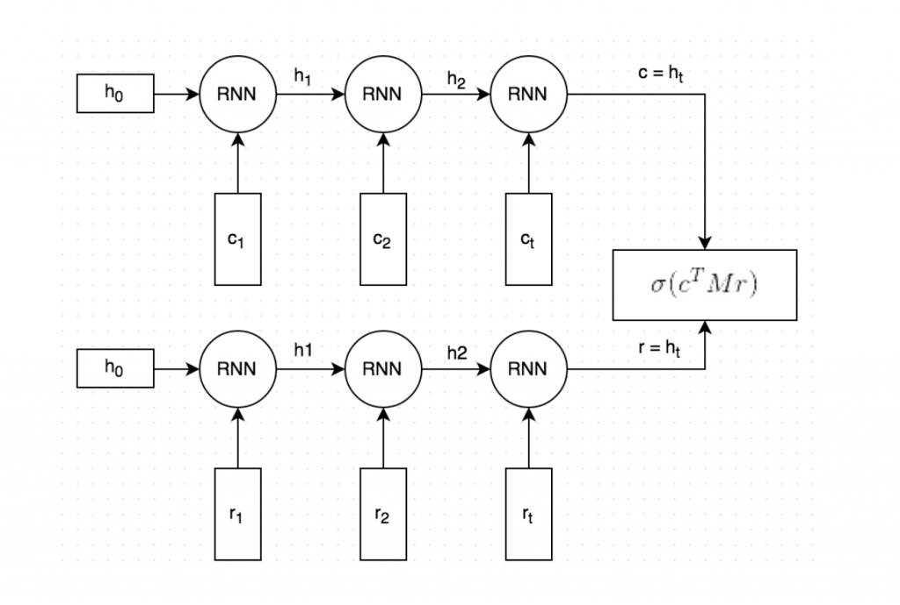

# 18. Pairwise Input

## 18.1 Overview

NLP领域的任务的输入输出有以下几种：

| 输入 | 输出 | 示例 | 备注 |
| :-: | :-: | :-: | :-: |
| Seq | label |  |  |
| Seq1 | Seq2 | 所有Seq2Seq问题，如翻译、Chatbox、序列生成等 |  |
| Seq1 + Seq2 | label | Pairwise类问题，比如判断2个Seq的关系或相似度、Chatbox等 |  | 

除7.2外，其他模型结构都是或类似于双胞胎网络(Siamese Network)，2个网络的结构是完全一致的，但其参数，有时共享，有时不同？

#### Practice

- <https://github.com/brightmart/nlu_sim> (Tensorflow)

    all kinds of baseline models for modeling tasks with **pair of sentences**: semantic text similarity(STS), natural language inference(NLI), paraphrase identification(PI), question answering(QA)

    模型有：DualTextCNN, DualBiLSTM, DualBiLSTMCNN, ESIM, SSE, BiLSTM with Attention

## 18.2 BiLSTMTextRelation

**Structure**: Input(Seq EOS Seq) -> Embeddding -> BiLSTM -> Average -> Softmax

Same with TextRNN, but input is special designed.

e.g. input: "How much is the computer ? EOS Price of laptop", where 'EOS' is a special token splitted input1 and input2

#### Code

- <https://github.com/brightmart/text_classification> (Tensorflow)

## 18.3 twoCNNTextRelation - OK

**Structure**: Seq1(Input1 -> Embedding -> TextCNN) + Seq2(Input2 -> Embedding -> TextCNN) -> Concatenate -> Softmax

产品词关系项目中使用的模型与此类似，在此基础上增加了第3个Input（结构化输入）。

#### Code

- <https://github.com/brightmart/text_classification> (Tensorflow)

## 18.4 BiLSTMTextRelationTwoRNN

又叫 Dual Encoder LSTM Network ?

#### Paper

[The Ubuntu Dialogue Corpus: A Large Dataset for Research in Unstructured Multi-Turn Dialogue Systems-2016](https://arxiv.org/abs/1506.08909)

**Structure**: Seq1(Input1 -> Embedding -> BiLSTM) + Seq2(Input2 -> Embedding -> BiLSTM) -> Dot Product -> Softmax

Dot Product作用：To measure the similarity of the predicted response r' and the actual response r by taking the dot product of these two vectors. A large dot product means the vectors are similar and that the response should receive a high score. We then apply a sigmoid function to convert this score into a probability. Similarity --> Probability

#### Article

- [Deep Learning for Chatbots, Part 2 – Implementing a Retrieval-Based Model in Tensorflow](http://www.wildml.com/2016/07/deep-learning-for-chatbots-2-retrieval-based-model-tensorflow/)

## 18.5 Others

#### Paper

[Pairwise relation classification with mirror instances and a combined convolutional neural network - Singapore2016](https://www.aclweb.org/anthology/C16-1223)

Github: <https://github.com/jefferyYu/Pairwise-relation-classification> (Torch, Lua)
